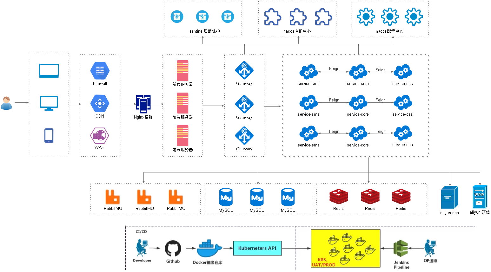

# Srb (尚融宝)

## 项目介绍

一个用来学习的前后端分离 P2P 金融项目

项目从0到1全过程都在我的[博客](##教程目录)中有详细介绍

## 项目架构

## 项目开发环境

### 基础环境
- Jdk1.8

- Maven

- Idea

- VS Code

  

### 后台技术栈
Spring Boot

Spring Cloud

Mybatis Plus：持久层框架

Lombok：简化代码

Swagger2：自动生成 Api 接口工具

Logback：日志

alibaba-easyexcel：Excel 读写

Spring Data Redis：访问 Redis

HttpClient：基于 Http 协议的客户端，可发送 Http 请求

Spring Task： 定时任务

### 数据库和中间件

MySql 5.7：关系型数据库

Redis：内存数据库

RabbitMQ：消息中间件

### 第三方接口

阿里云短信

阿里云 OSS

资金托管平台 API 对接 汇付宝

### 前端技术栈

Node.js： JavaScript 运行环境

ES6：JavaScript的模块化版本

axios：一个发送Ajax请求的工具

Vue.js：web 界面的渐进式框架

Element-UI：前端组件库

模块化开发：解决javascript变量全局空间污染的问题

NPM：模块资源管理器

vue-element-admin：基于Vue.js的后台管理系统UI集成方案

NuxtJS：基于Vue.js构建的服务器端渲染应用的轻量级框架

## 教程目录

[Srb (一): 项目介绍](https://frankeleyns.github.io/2022/01/22/Srb-1-%E9%A1%B9%E7%9B%AE%E4%BB%8B%E7%BB%8D/)

[Srb(二):后端工程搭建](https://frankeleyns.github.io/2022/02/03/Srb-2-%E5%90%8E%E7%AB%AF%E5%B7%A5%E7%A8%8B%E6%90%AD%E5%BB%BA/)

[Srb(三):前端工程搭建](https://frankeleyns.github.io/2022/02/07/Srb-3-%E5%89%8D%E7%AB%AF%E5%B7%A5%E7%A8%8B%E6%90%AD%E5%BB%BA/#Srb-%E4%B8%89-%E5%89%8D%E7%AB%AF%E5%B7%A5%E7%A8%8B%E6%90%AD%E5%BB%BA)

