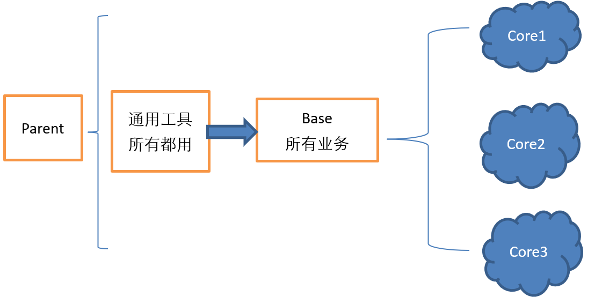
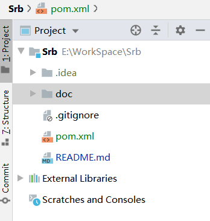
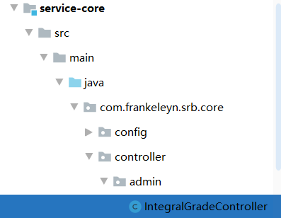
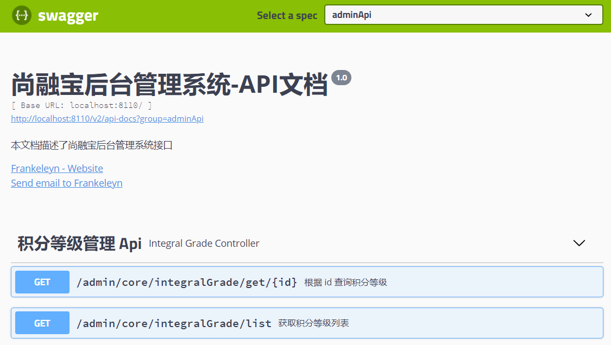
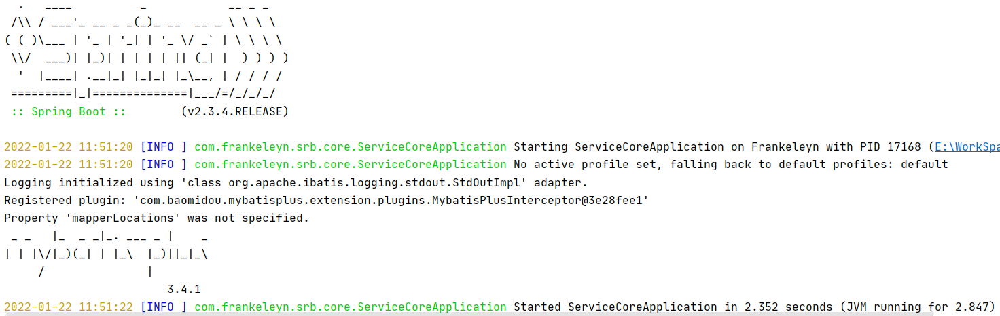

# 01-后台接口工程搭建


## 基础框架结构

**Srb：** 总工程，父依赖

**srb-common：**工程通用包依赖，其他的工程都引入这个通用工程 ( 非微服务 )

**service-base：**持久层的依赖 ( 非微服务 )

**service-core：**核心业务 ( 具体的微服务 )




## 一、创建父工程 Srb


### 1. 新建一个文件夹 取名 Srb




### 2. 添加一个pom.xml

```xml
<?xml version="1.0" encoding="UTF-8"?>
<project xmlns="http://maven.apache.org/POM/4.0.0"
         xmlns:xsi="http://www.w3.org/2001/XMLSchema-instance"
         xsi:schemaLocation="http://maven.apache.org/POM/4.0.0 http://maven.apache.org/xsd/maven-4.0.0.xsd">
    <modelVersion>4.0.0</modelVersion>

    <groupId>com.frankeleyn</groupId>
    <artifactId>srb</artifactId>
    <version>1.0</version>

    <!-- 打包方式 -->
    <packaging>pom</packaging>


    <!-- 配置 Spring Boot 版本 -->
    <parent>
        <groupId>org.springframework.boot</groupId>
        <artifactId>spring-boot-starter-parent</artifactId>
        <version>2.3.4.RELEASE</version>
    </parent>


    <!-- 配置 pom 依赖版本号 -->
    <properties>
        <java.version>1.8</java.version>
        <spring-cloud-alibaba.version>2.2.2.RELEASE</spring-cloud-alibaba.version>
        <spring-cloud.version>Hoxton.SR8</spring-cloud.version>
        <mybatis-plus.version>3.4.1</mybatis-plus.version>
        <velocity.version>2.0</velocity.version>
        <swagger.version>2.9.2</swagger.version>
        <swagger-bootstrap-ui.version>1.9.2</swagger-bootstrap-ui.version>
        <commons-lang3.version>3.9</commons-lang3.version>
        <commons-fileupload.version>1.3.1</commons-fileupload.version>
        <commons-io.version>2.6</commons-io.version>
        <alibaba.easyexcel.version>2.1.1</alibaba.easyexcel.version>
        <apache.xmlbeans.version>3.1.0</apache.xmlbeans.version>
        <fastjson.version>1.2.28</fastjson.version>
        <gson.version>2.8.2</gson.version>
        <json.version>20170516</json.version>
        <aliyun-java-sdk-core.version>4.3.3</aliyun-java-sdk-core.version>
        <aliyun-sdk-oss.version>3.10.2</aliyun-sdk-oss.version>
        <jodatime.version>2.10.1</jodatime.version>
        <jwt.version>0.7.0</jwt.version>
        <httpclient.version>4.5.1</httpclient.version>
    </properties>

    <!-- 配置 pom 依赖-->
    <dependencyManagement>
        <dependencies>

            <!--Spring Cloud-->
            <dependency>
                <groupId>org.springframework.cloud</groupId>
                <artifactId>spring-cloud-dependencies</artifactId>
                <version>${spring-cloud.version}</version>
                <type>pom</type>
                <scope>import</scope>
            </dependency>

            <!--Spring Cloud Alibaba-->
            <dependency>
                <groupId>com.alibaba.cloud</groupId>
                <artifactId>spring-cloud-alibaba-dependencies</artifactId>
                <version>${spring-cloud-alibaba.version}</version>
                <type>pom</type>
                <scope>import</scope>
            </dependency>

            <!--mybatis-plus-->
            <dependency>
                <groupId>com.baomidou</groupId>
                <artifactId>mybatis-plus-boot-starter</artifactId>
                <version>${mybatis-plus.version}</version>
            </dependency>
            <!--mybatis-plus 代码生成器-->
            <dependency>
                <groupId>com.baomidou</groupId>
                <artifactId>mybatis-plus-generator</artifactId>
                <version>${mybatis-plus.version}</version>
            </dependency>
            <!-- Mybatis Plus 代码生成器模板引擎,  -->
            <dependency>
                <groupId>org.apache.velocity</groupId>
                <artifactId>velocity-engine-core</artifactId>
                <version>${velocity.version}</version>
            </dependency>

            <!--swagger-->
            <dependency>
                <groupId>io.springfox</groupId>
                <artifactId>springfox-swagger2</artifactId>
                <version>${swagger.version}</version>
            </dependency>
            <!--swagger ui-->
            <dependency>
                <groupId>io.springfox</groupId>
                <artifactId>springfox-swagger-ui</artifactId>
                <version>${swagger.version}</version>
            </dependency>
            <!--swagger-bootstrap-ui-->
            <dependency>
                <groupId>com.github.xiaoymin</groupId>
                <artifactId>swagger-bootstrap-ui</artifactId>
                <version>${swagger-bootstrap-ui.version}</version>
            </dependency>

            <!--commons-lang3-->
            <dependency>
                <groupId>org.apache.commons</groupId>
                <artifactId>commons-lang3</artifactId>
                <version>${commons-lang3.version}</version>
            </dependency>

            <!--文件上传-->
            <dependency>
                <groupId>commons-fileupload</groupId>
                <artifactId>commons-fileupload</artifactId>
                <version>${commons-fileupload.version}</version>
            </dependency>

            <!--commons-io-->
            <dependency>
                <groupId>commons-io</groupId>
                <artifactId>commons-io</artifactId>
                <version>${commons-io.version}</version>
            </dependency>

            <!--excel解析-->
            <dependency>
                <groupId>com.alibaba</groupId>
                <artifactId>easyexcel</artifactId>
                <version>${alibaba.easyexcel.version}</version>
            </dependency>
            <!--excel解析依赖-->
            <dependency>
                <groupId>org.apache.xmlbeans</groupId>
                <artifactId>xmlbeans</artifactId>
                <version>${apache.xmlbeans.version}</version>
            </dependency>

            <!--json-->
            <dependency>
                <groupId>com.alibaba</groupId>
                <artifactId>fastjson</artifactId>
                <version>${fastjson.version}</version>
            </dependency>
            <dependency>
                <groupId>org.json</groupId>
                <artifactId>json</artifactId>
                <version>${json.version}</version>
            </dependency>
            <dependency>
                <groupId>com.google.code.gson</groupId>
                <artifactId>gson</artifactId>
                <version>${gson.version}</version>
            </dependency>

            <!--阿里云SDK远程调用-->
            <dependency>
                <groupId>com.aliyun</groupId>
                <artifactId>aliyun-java-sdk-core</artifactId>
                <version>${aliyun-java-sdk-core.version}</version>
            </dependency>

            <!--阿里云文件管理-->
            <dependency>
                <groupId>com.aliyun.oss</groupId>
                <artifactId>aliyun-sdk-oss</artifactId>
                <version>${aliyun-sdk-oss.version}</version>
            </dependency>

            <!--日期时间工具-->
            <dependency>
                <groupId>joda-time</groupId>
                <artifactId>joda-time</artifactId>
                <version>${jodatime.version}</version>
            </dependency>

            <!--jwt工具-->
            <dependency>
                <groupId>io.jsonwebtoken</groupId>
                <artifactId>jjwt</artifactId>
                <version>${jwt.version}</version>
            </dependency>

            <!--httpclient-->
            <dependency>
                <groupId>org.apache.httpcomponents</groupId>
                <artifactId>httpclient</artifactId>
                <version>${httpclient.version}</version>
            </dependency>

        </dependencies>
    </dependencyManagement>


</project>
```


## 二、创建模块 srb-common


### 1. 创建 Maven 模块

在 Srb 父工程下，创建一个 Maven 模块

Group: **com.frankeleyn**

Artifact: **srb-common**


### 2.  配置 pom

```xml
<dependencies>
    <dependency>
        <groupId>org.springframework.boot</groupId>
        <artifactId>spring-boot-starter-web</artifactId>
    </dependency>

    <!--lombok用来简化实体类：需要安装lombok插件-->
    <dependency>
        <groupId>org.projectlombok</groupId>
        <artifactId>lombok</artifactId>
    </dependency>
</dependencies>
```


## 三、创建模块 service-base


### 1. 创建 Maven 模块

Group: **com.frankeleyn**

Artifact: **service-base**


### 2. 配置 pom

```xml
<dependencies>
    <!-- 引入 common 项目-->
    <dependency>
        <groupId>com.frankeleyn</groupId>
        <artifactId>srb-common</artifactId>
        <version>1.0</version>
    </dependency>
    <!--swagger-->
    <dependency>
        <groupId>io.springfox</groupId>
        <artifactId>springfox-swagger2</artifactId>
    </dependency>
    <!--swagger ui-->
    <dependency>
        <groupId>io.springfox</groupId>
        <artifactId>springfox-swagger-ui</artifactId>
    </dependency>

    <!--mysql-->
    <dependency>
        <groupId>mysql</groupId>
        <artifactId>mysql-connector-java</artifactId>
    </dependency>
    <!--mybatis-plus-->
    <dependency>
        <groupId>com.baomidou</groupId>
        <artifactId>mybatis-plus-boot-starter</artifactId>
    </dependency>
    <!--mybatis-plus 代码生成器-->
    <dependency>
        <groupId>com.baomidou</groupId>
        <artifactId>mybatis-plus-generator</artifactId>
    </dependency>
    <!-- Mybatis Plus 代码生成器模板引擎,  -->
    <dependency>
        <groupId>org.apache.velocity</groupId>
        <artifactId>velocity-engine-core</artifactId>
    </dependency>

</dependencies>
```


## 四、创建模块 service-core

### 1. 创建 Maven 模块

Group: **com.frankeleyn**

Artifact: **service-core**


### 2. 配置 pom

```xml
<dependencies>

    <dependency>
        <groupId>com.frankeleyn</groupId>
        <artifactId>service-base</artifactId>
        <version>1.0</version>
    </dependency>
    
    <dependency>
        <groupId>org.springframework.boot</groupId>
        <artifactId>spring-boot-starter-test</artifactId>
        <scope>test</scope>
    </dependency>

</dependencies>
```


## 五、启动应用程序

进入 **service-core** 项目中


### 1. 配置文件

创建 **application.properties**

```properties
# 端口号
server.port= 8110

# ==================== 数据源设置 =========================
spring.datasource.driver-class-name=com.mysql.cj.jdbc.Driver
spring.datasource.url=jdbc:mysql://localhost:3306/srb_core?serverTimezone=GMT%2B8&characterEncoding=utf-8&useSSL=false
spring.datasource.username=root
spring.datasource.password=123456

# ================ mybatis 配置 =========================
# 驼峰命名
mybatis-plus.configuration.map-underscore-to-camel-case=true
# 扫描映射配置文件
mybatis-plus.mapper-locations=classpath:mapper/*Mapper.xml
# 打印 sql
mybatis-plus.configuration.log-impl=org.apache.ibatis.logging.stdout.StdOutImpl
```


### 2. 创建启动类

```java
package com.frankeleyn.srb.core;

import org.springframework.boot.SpringApplication;
import org.springframework.boot.autoconfigure.SpringBootApplication;

/**
 * @author Frankeleyn
 * @date 2022/1/21 11:53
 */
@SpringBootApplication
public class ServiceCoreApplication {
    public static void main(String[] args) {
        SpringApplication.run(ServiceCoreApplication.class, args);
    }
}
```


### 3. 创建 Mybatis Plus 配置文件

创建一个 **config** 包，创建类 **MybatisPlusConfig**

```java
package com.frankeleyn.srb.core.config;

import com.baomidou.mybatisplus.annotation.DbType;
import com.baomidou.mybatisplus.extension.plugins.MybatisPlusInterceptor;
import com.baomidou.mybatisplus.extension.plugins.inner.OptimisticLockerInnerInterceptor;
import com.baomidou.mybatisplus.extension.plugins.inner.PaginationInnerInterceptor;
import org.mybatis.spring.annotation.MapperScan;
import org.springframework.context.annotation.Bean;
import org.springframework.context.annotation.Configuration;
import org.springframework.transaction.annotation.EnableTransactionManagement;

/**
 * @author Frankeleyn
 * @date 2022/1/17 15:22
 */
@Configuration
@EnableTransactionManagement
@MapperScan("com.frankeleyn.srb.core.mapper")
public class MybatisPlusConfig {

    @Bean
    public MybatisPlusInterceptor mybatisPlusInterceptor() {
        MybatisPlusInterceptor interceptor = new MybatisPlusInterceptor();
        // 将分页插件放入容器
        interceptor.addInnerInterceptor(new PaginationInnerInterceptor(DbType.MYSQL));
        // 添加乐观锁插件
        interceptor.addInnerInterceptor(new OptimisticLockerInnerInterceptor());
        return interceptor;
    }
}
```


## 六、代码生成器


### 1. 创建数据库

创建数据库 **srb_core**

并执行 sql 脚本初始化数据结构和数据


### 2. 创建代码生成器

在 **test** 目录中创建测试用例，并执行

```java
package com.frankeleyn.srb.core;

import com.baomidou.mybatisplus.annotation.DbType;
import com.baomidou.mybatisplus.annotation.IdType;
import com.baomidou.mybatisplus.generator.AutoGenerator;
import com.baomidou.mybatisplus.generator.config.DataSourceConfig;
import com.baomidou.mybatisplus.generator.config.GlobalConfig;
import com.baomidou.mybatisplus.generator.config.PackageConfig;
import com.baomidou.mybatisplus.generator.config.StrategyConfig;
import com.baomidou.mybatisplus.generator.config.rules.NamingStrategy;
import org.junit.jupiter.api.Test;
import org.springframework.boot.test.context.SpringBootTest;

/**
 * @author Frankeleyn
 * @date 2022/1/21 14:03
 */
@SpringBootTest
public class GeneratorTest {

    @Test
    public void generate() {
        // 创建 mp 代码生成器
        AutoGenerator autoGenerator = new AutoGenerator();

        // 1 全局配置, 如命名规则，主键策略等
        GlobalConfig gc = new GlobalConfig();
        String projectPath = System.getProperty("user.dir");
        gc.setOutputDir(projectPath + "/src/main/java");
        gc.setAuthor("Frankeleyn");
        // 生成后是否打开资源管理器
        gc.setOpen(false);
        // 去掉Service接口的首字母I
        gc.setServiceName("%sService");
        // 主键策略
        gc.setIdType(IdType.AUTO);
        // 开启Swagger2模式
        gc.setSwagger2(true); 
        autoGenerator.setGlobalConfig(gc);

        // 2 数据源配置
        DataSourceConfig dataSourceConfig = new DataSourceConfig();
        dataSourceConfig.setUrl("jdbc:mysql://localhost:3306/srb_core?serverTimezone=GMT%2B8&characterEncoding=utf-8&useSSL=false");
        dataSourceConfig.setUsername("root");
        dataSourceConfig.setPassword("123456");
        dataSourceConfig.setDriverName("com.mysql.cj.jdbc.Driver");
        dataSourceConfig.setDbType(DbType.MYSQL);
        autoGenerator.setDataSource(dataSourceConfig);

        // 3 生成映射代码类的包配置
        PackageConfig packageConfig = new PackageConfig();
        packageConfig.setParent("com.frankeleyn.srb.core");
        packageConfig.setEntity("pojo.entity");
        autoGenerator.setPackageInfo(packageConfig);

        // 4 其他配置，如下划线，是否逻辑删除等
        StrategyConfig strategy = new StrategyConfig();
        //数据库表映射到实体的命名策略
        strategy.setNaming(NamingStrategy.underline_to_camel);
        //数据库表字段映射到实体的命名策略
        strategy.setColumnNaming(NamingStrategy.underline_to_camel);
        // lombok, 就是添加一个 @Data
        strategy.setEntityLombokModel(true);
        //逻辑删除字段名
        strategy.setLogicDeleteFieldName("is_deleted");
        //去掉布尔值的is_前缀（确保tinyint(1)）
        strategy.setEntityBooleanColumnRemoveIsPrefix(true);
        //restful api风格控制器
        strategy.setRestControllerStyle(true); 
        autoGenerator.setStrategy(strategy);

        // 执行 mp 代码生成器
        autoGenerator.execute();
    }
}
```

### 3. 执行结果


# 02-积分等级 CRUD


## 一、积分等级列表接口

### 1. 编写积分等级管理接口

在 **controller** 包中新建 **admin** 包，将自动生成的类 **IntegralGradeController** 移动到该包

```java
@CrossOrigin
@RestController
@RequestMapping("/admin/core/integralGrade")
public class IntegralGradeController {

    @Autowired
    private IntegralGradeService integralGradeService;

    @GetMapping("/list")
    public List<IntegralGrade> findAll() {
        return integralGradeService.list();
    }
    
    @DeleteMapping("/remove/{id}")
    public boolean removeById(@PathVariable Long id) {
        return integralGradeService.removeById(id);
    }
    
    @PostMapping("/save")
    public boolean save(@ReqestBody IntegralGrade integralGrade ) {
        return integralGradeService.save(integralGrade);
    }
    
    @PutMapping("/update")
    public boolean update(@ReqestBody IntegralGrade integralGrade ) {
        return integralGradeService.updateById(integralGrade);
    }
    
}
```


### 2. 测试

访问：http://localhost:8110/admin/core/integralGrade/list 查看 json 结果


## 二、配置 Swagger2

Swagger 是一个根据接口自动生成 api 文档和对应测试的 web 页面


### 1. Swagger2 配置文件

新建 **config** 文件夹，然后新建 **Swagger2Config** 类

```java
package com.frankeleyn.srb.core.config;

import com.google.common.base.Predicates;
import org.springframework.context.annotation.Bean;
import org.springframework.context.annotation.Configuration;
import springfox.documentation.builders.ApiInfoBuilder;
import springfox.documentation.builders.PathSelectors;
import springfox.documentation.service.ApiInfo;
import springfox.documentation.service.Contact;
import springfox.documentation.spi.DocumentationType;
import springfox.documentation.spring.web.plugins.Docket;
import springfox.documentation.swagger2.annotations.EnableSwagger2;

/**
 * @author Frankeleyn
 * @date 2022/1/21 15:03
 */
@EnableSwagger2
@Configuration
public class Swagger2Config {

    @Bean
    public Docket coreApiConfig() {
        Docket docket = new Docket(DocumentationType.SWAGGER_2)
                  .apiInfo(adminApiInfo())
                  .groupName("adminApi")
                  .select()
                   // 扫描 Controller 下面的 admin 包
                  .paths(Predicates.and(PathSelectors.regex("/admin/.*")))
                  .build();
        return docket;
    }

    private ApiInfo adminApiInfo(){

        return new ApiInfoBuilder()
                .title("尚融宝后台管理系统-API文档")
                .description("本文档描述了尚融宝后台管理系统接口")
                .version("1.0")
                .contact(new Contact("Frankeleyn", "https://githubfast.com/Frankeleyns/", "2582726641@qq.com"))
                .build();
    }

}
```


### 2. 移动 Controller

在 **controller** 包下，新建 **admin** 包，将 **IntegralGradeController** 移动到 admin 文件夹下




### 3. Swagger 常用注解

**实体类注解：**entity的实体类中可以添加一些自定义设置

```java
@ApiModelProperty(value = "创建时间", example = "2019-01-01 8:00:00")
private LocalDateTime createTime;

@ApiModelProperty(value = "更新时间", example = "2019-01-01 8:00:00")
private LocalDateTime updateTime;
```


**controller** 注解

定义在类上：

```java
@Api(tags = "积分等级管理 Api")
```

定义在方法上：

```java
@ApiOperation(value = "根据 id 删除积分等级", notes = "逻辑删除")
```

定义在参数上：

```java
@ApiParam(value = "数据id", required = true, example = "100")
```


### 4. 查看 Swagger 文档

重启服务器查看接口文档：http://localhost:8110/swagger-ui.html




# 03-统一返回结果


## 一、介绍

通常项目中我们会将响应结果封装成 json 返回，一般我们会将所有接口的数据格式统一， 使前端工程师调用我们项目的外部接口更一致。

一般情况下，统一返回数据格式没有固定的格式，只要能描述清楚返回的数据状态以及要返回的具体数据就可以。但是一般会包含**状态码、返回消息、数据**这三部分内容：

```json
{
   "code" : 0,
    "message" : "success",
    "data" : "数据"
}
```


## 二、定义统一返回结果


### 1. 创建枚举

在 **srb-common** 项目下，新建 **result** 包，创建枚举类 **ReponseEnum**

```java
package com.frankeleyn.common.result;

/**
 * @author Frankeleyn
 * @date 2022/1/21 15:38
 */
@Getter
@AllArgsConstructor
@ToString
public enum ResponseEnum {

    SUCCESS(0, "成功"),
    ERROR(-1, "服务器内部错误"),

    //-1xx 服务器错误
    BAD_SQL_GRAMMAR_ERROR(-101, "sql语法错误"),
    SERVLET_ERROR(-102, "servlet请求异常"), //-2xx 参数校验
    UPLOAD_ERROR(-103, "文件上传错误"),
    EXPORT_DATA_ERROR(104, "数据导出失败"),


    //-2xx 参数校验
    BORROW_AMOUNT_NULL_ERROR(-201, "借款额度不能为空"),
    MOBILE_NULL_ERROR(-202, "手机号码不能为空"),
    MOBILE_ERROR(-203, "手机号码不正确"),
    PASSWORD_NULL_ERROR(204, "密码不能为空"),
    CODE_NULL_ERROR(205, "验证码不能为空"),
    CODE_ERROR(206, "验证码错误"),
    MOBILE_EXIST_ERROR(207, "手机号已被注册"),
    LOGIN_MOBILE_ERROR(208, "用户不存在"),
    LOGIN_PASSWORD_ERROR(209, "密码错误"),
    LOGIN_LOKED_ERROR(210, "用户被锁定"),
    LOGIN_AUTH_ERROR(-211, "未登录"),


    USER_BIND_IDCARD_EXIST_ERROR(-301, "身份证号码已绑定"),
    USER_NO_BIND_ERROR(302, "用户未绑定"),
    USER_NO_AMOUNT_ERROR(303, "用户信息未审核"),
    USER_AMOUNT_LESS_ERROR(304, "您的借款额度不足"),
    LEND_INVEST_ERROR(305, "当前状态无法投标"),
    LEND_FULL_SCALE_ERROR(306, "已满标，无法投标"),
    NOT_SUFFICIENT_FUNDS_ERROR(307, "余额不足，请充值"),

    PAY_UNIFIEDORDER_ERROR(401, "统一下单错误"),

    ALIYUN_SMS_LIMIT_CONTROL_ERROR(-502, "短信发送过于频繁"),//业务限流
    ALIYUN_SMS_ERROR(-503, "短信发送失败"),//其他失败

    WEIXIN_CALLBACK_PARAM_ERROR(-601, "回调参数不正确"),
    WEIXIN_FETCH_ACCESSTOKEN_ERROR(-602, "获取access_token失败"),
    WEIXIN_FETCH_USERINFO_ERROR(-603, "获取用户信息失败"),
    ;
    
    private Integer code;//状态码
    private String message;//消息
}
```


### 2、定义统一结果类

```java
package com.frankeleyn.common.result;

/**
 * @author Frankeleyn
 * @date 2022/1/21 15:38
 */
@Data
public class R {

    private Integer code;

    private String message;

    private Map<String, Object> data = new HashMap();

    /**
     * 构造器私有
     */
    private R(){}

    /**
     * 返回成功
     */
    public static R ok(){
        R r = new R();
        r.setCode(ResponseEnum.SUCCESS.getCode());
        r.setMessage(ResponseEnum.SUCCESS.getMessage());
        return r;
    }

    public static R ok(String message) {
        return ok().message(message);
    }

    public static R ok(String key, Object value) {
        return ok().data(key, value);
    }

    /**
     * 返回失败
     */
    public static R error(){
        R r = new R();
        r.setCode(ResponseEnum.ERROR.getCode());
        r.setMessage(ResponseEnum.ERROR.getMessage());
        return r;
    }

    public static R error(String message) {
        return error().message(message);
    }

    public static R error(Integer code, String message) {
        return error(message).code(code);
    }

    /**
     * 设置特定结果
     */
    public static R setResult(ResponseEnum responseEnum){
        R r = new R();
        r.setCode(responseEnum.getCode());
        r.setMessage(responseEnum.getMessage());
        return r;
    }

    public R message(String message){
        this.setMessage(message);
        return this;
    }

    public R code(Integer code){
        this.setCode(code);
        return this;
    }

    public R data(String key, Object value){
        this.data.put(key, value);
        return this;
    }

    public R data(Map<String, Object> map){
        this.setData(map);
        return this;
    }
}
```


## 三、使用统一返回结果

修改 **IntegralGradeController** 中的方法


### 1. 修改 findAll

```java
@ApiOperation("获取积分等级列表")
@GetMapping("/list")
public R findAll() {
    List<IntegralGrade> integralGradeList = integralGradeService.list();
    return R.ok("integralGradeList", integralGradeList);
}
```


### 2. 修改 removeById

```java
@ApiOperation(value = "根据 id 删除积分等级", notes = "逻辑删除")
@DeleteMapping("/remove/{id}")
public R removeById(@ApiParam("积分等级 id") @PathVariable Long id) {
    boolean remove = integralGradeService.removeById(id);
    if (remove)
        return R.ok("删除积分等级成功");
    else
        return R.error("删除积分等级失败");
}
```


### 3. 修改 save

```java
@ApiOperation("新增积分等级")
@PostMapping("/save")
public R save(@ApiParam("积分等级对象") @RequestBody IntegralGrade integralGrade) {
    boolean save = integralGradeService.save(integralGrade);
    if (save)
        return R.ok("新增积分等级成功");
    else
        return R.error("新增积分等级失败");
}
```


### 4. 修改 update

```java
@ApiOperation("修改积分等级")
@PutMapping("/update")
public R updateById(@ApiParam("积分等级对象") @RequestBody IntegralGrade integralGrade) {
    boolean update = integralGradeService.updateById(integralGrade);
    if (update)
        return R.ok("修改积分等级成功");
    else
        return R.error("修改积分等级失败");
}
```


### 5. 根据 id 查询

```java
@ApiOperation("根据 id 查询积分等级")
@GetMapping("/get/{id}")
public R findById(@ApiParam("积分等级 id") @PathVariable Long id) {
    IntegralGrade integralGrade = integralGradeService.getById(id);
    if (Objects.nonNull(integralGrade)) 
        return R.ok("integralGrade", integralGrade);
    else 
        return R.error("未查询到积分等级");
}
```


# 04-统一异常处理


## 一、介绍

在接口发生异常时，一般是在 **controller** 抛出 **exception** 异常时，通过 **aop** 的异常通知处理接口的返回结果的全局设置，叫 **统一异常处理**。


## 二、功能实现


### 1. 创建统一异常处理器

在 **srb-common** 中创建 **exception** 包，创建统一异常处理器类 **UnifiedExceptionHandler**

```java
package com.frankeleyn.common.exception;

@Component
@RestControllerAdvice
public class UnifiedExceptionHandler {

    @ExceptionHandler(Exception.class)
    public R handleException(Exception e) {
        return R.error();
    }

}
```


### 2. service-core 添加扫描

**UnifiedExceptionHandler** 所在位置，是 **service-core** 服务启动器扫描不到的，所以需要在它的启动类中自定义扫描路径：

```java
@SpringBootApplication
@ComponentScan(basePackages = {"com.frankeleyn.srb","com.frankeleyn.common"})
public class ServiceCoreApplication {
```


### 3. 测试

返回统一错误结果


## 三、处理特定异常

如果我们不想显示统一的“服务器内部错误”，需要个性化的显示异常信息，那么需要针对特定的异常做处理


### 1. 添加依赖

在 **srb-common** 项目的 pom 中

```xml
<dependency>
    <groupId>org.springframework</groupId>
    <artifactId>spring-jdbc</artifactId>
</dependency>
```


### 2. 添加异常处理方法

在 **UnifiedExceptionHandler** 中添加

```java
@ExceptionHandler(BadSqlGrammarException.class)
public R handleSQLException(BadSqlGrammarException e) {
    System.out.println("SQL 异常" + e.getMessage());
    return R.error("SQL 语法错误");
}
```


### 3. 测试


## 四、自定义异常

有些数据，数据库认为它是合理的，但是不符合我们现实中的认知，比如我的积分等级将你的起始借款金额设置为负数，这明显不符合逻辑，哪里有借款额度是负数的，但是程序却不认为这是错的，此类情况在开发中还有很多，所以我们就需要自定义异常用于业务处理，易于维护。


### 1.  创建自定义异常类

在 **srb-common** 项目的 **Exception** 包下新建 **BusinessException**

```java
package com.frankeleyn.common.exception;

@Data
@NoArgsConstructor
public class BusinessException extends RuntimeException {

    //状态码
    private Integer code;

    //错误消息
    private String message;

    /**
     *
     * @param message 错误消息
     */
    public BusinessException(String message) {
        this.message = message;
    }

    /**
     *
     * @param message 错误消息
     * @param code 错误码
     */
    public BusinessException(String message, Integer code) {
        this.message = message;
        this.code = code;
    }

    /**
     *
     * @param message 错误消息
     * @param code 错误码
     * @param cause 原始异常对象
     */
    public BusinessException(String message, Integer code, Throwable cause) {
        super(cause);
        this.message = message;
        this.code = code;
    }

    /**
     *
     * @param resultCodeEnum 接收枚举类型
     */
    public BusinessException(ResponseEnum resultCodeEnum) {
        this.message = resultCodeEnum.getMessage();
        this.code = resultCodeEnum.getCode();
    }

    /**
     *
     * @param resultCodeEnum 接收枚举类型
     * @param cause 原始异常对象
     */
    public BusinessException(ResponseEnum resultCodeEnum, Throwable cause) {
        super(cause);
        this.message = resultCodeEnum.getMessage();
        this.code = resultCodeEnum.getCode();
    }

}
```


### 2. 修改 Controller

修改 **IntegralGradeController** 中的 **save** 方法：

```java
@ApiOperation("新增积分等级")
@PostMapping("/save")
public R save(@ApiParam("积分等级对象") @RequestBody IntegralGrade integralGrade) {

    BigDecimal borrowAmount = integralGrade.getBorrowAmount();
    if (Objects.isNull(borrowAmount) || borrowAmount.intValue() <= 0) {
        // 借款额度小于等于0，此处抛出异常
        throw new BusinessException(ResponseEnum.BORROW_AMOUNT_NULL_ERROR);
    }

    boolean save = integralGradeService.save(integralGrade);
    if (save)
        return R.ok("新增积分等级成功");
    else
        return R.error("新增积分等级失败");
}
```


### 3. 添加异常处理方法

**UnifiedExceptionHandler** 类中添加：

```java
/**
 * 自定义异常
 * @param e
 * @return
 */
@ExceptionHandler(BusinessException.class)
public R handleBusinessException(BusinessException e){
    System.out.println("自定义异常" + e.getMessage());
    return R.error(e.getCode(), e.getMessage());
}
```


### 4. 测试

**参数**


**结果**


## 五、异常处理优化

我们的项目中需要对参数进行校验，于是就有大量的 if else，其实我们可以使用优雅的 **Assert(断言)** 类来校验业务的异常情况，消除 if else。


### 1. 断言示例

```java
package com.frankeleyn.srb.core;

@SpringBootTest
public class AssertTest {

    @Test
    public void testNotAssert() {
        Object o = null;

        if (o == null) {
            throw new IllegalArgumentException("对象不能为空");
        }
    }

    @Test
    public void testAssert() {
        Object o = null;
        Assert.notNull(o, "对象不能为空");
    }
}
```

上述两个方法是等价的结果，但是断言封装了 if else，让你代码看起来更干净。


### 2. 自定义断言类

在 **srb-common** 的 **exception** 包下新建 **Assert** 类

```java
package com.frankeleyn.common.exception;

/**
 * @author Frankeleyn
 * @date 2022/1/22 10:52
 */
@Slf4j
public abstract class Assert {

    /**
     * 断言对象不为空
     * 如果对象obj为空，则抛出异常
     * @param obj 待判断对象
     */
    public static void notNull(Object obj, ResponseEnum responseEnum) {
        if (obj == null) {
            log.info("obj is null...............");
            throw new BusinessException(responseEnum);
        }
    }


    /**
     * 断言对象为空
     * 如果对象obj不为空，则抛出异常
     * @param object
     * @param responseEnum
     */
    public static void isNull(Object object, ResponseEnum responseEnum) {
        if (object != null) {
            log.info("obj is not null......");
            throw new BusinessException(responseEnum);
        }
    }

    /**
     * 断言表达式为真
     * 如果不为真，则抛出异常
     *
     * @param expression 是否成功
     */
    public static void isTrue(boolean expression, ResponseEnum responseEnum) {
        if (!expression) {
            log.info("fail...............");
            throw new BusinessException(responseEnum);
        }
    }

    /**
     * 断言两个对象不相等
     * 如果相等，则抛出异常
     * @param m1
     * @param m2
     * @param responseEnum
     */
    public static void notEquals(Object m1, Object m2,  ResponseEnum responseEnum) {
        if (m1.equals(m2)) {
            log.info("equals...............");
            throw new BusinessException(responseEnum);
        }
    }

    /**
     * 断言两个对象相等
     * 如果不相等，则抛出异常
     * @param m1
     * @param m2
     * @param responseEnum
     */
    public static void equals(Object m1, Object m2,  ResponseEnum responseEnum) {
        if (!m1.equals(m2)) {
            log.info("not equals...............");
            throw new BusinessException(responseEnum);
        }
    }

    /**
     * 断言参数不为空
     * 如果为空，则抛出异常
     * @param s
     * @param responseEnum
     */
    public static void notEmpty(String s, ResponseEnum responseEnum) {
        if (StringUtils.isEmpty(s)) {
            log.info("is empty...............");
            throw new BusinessException(responseEnum);
        }
    }
}
```


### 3. 修改 Controller

修改 **IntegralGradeController** 中的 **save** 方法：

```java
@ApiOperation("新增积分等级")
@PostMapping("/save")
public R save(@ApiParam("积分等级对象") @RequestBody IntegralGrade integralGrade) {
    BigDecimal borrowAmount = integralGrade.getBorrowAmount();
    // 借款额度不能为空
    Assert.notNull(borrowAmount, ResponseEnum.BORROW_AMOUNT_NULL_ERROR);
    // 借款额读不嫩能为0
    Assert.isTrue(0!=borrowAmount.intValue(), ResponseEnum.BORROW_AMOUNT_NULL_ERROR);

    boolean save = integralGradeService.save(integralGrade);
    if (save)
        return R.ok("新增积分等级成功");
    else
        return R.error("新增积分等级失败");
}
```


# 05-统一日志处理


## 一、Logback 日志


### 1、什么是日志

通过日志查看程序的运行过程，运行信息，异常信息等


### 2. 日志级别

日志记录器（Logger）的行为是分等级的。如下所示：

分为：**TRACE, DEBUG, INFO(默认), WARN, ERROR**

以上日志级别，从左至右，内容量**从多到少**


### 3. 创建日志文件

spring boot 内部使用 Logback 作为日志默认实现的框架。

**先删除前面在配置文件中的日志级别配置**

**resources** 中创建 **logback-spring.xml** （默认日志文件的名字）

```xml
<?xml version="1.0" encoding="UTF-8"?>
<configuration>
</configuration>
```


## 二、基本配置说明


### 1. configuration

日志配置的根节点

```xml
<configuration></configuration>
```


### 2.contextName

**日志文件的名称**，每个logger都关联到logger上下文，默认上下文名称为“default”，用于区分不同的应用程序。

```xml
<contextName>Srb</contextName>
```


### 3. property

日志的属性，相当于 Java 类的属性，用来存储颜色、大小、打印方式等。

通过<property>定义的值会被插入到logger上下文中。定义变量后，可以使“${}”来使用变量。

```xml
<!-- 日志的输出目录 -->
<property name="log.path" value="E:/WorkSpace/log/srb"/>

<!--控制台日志格式：彩色日志-->
<!-- magenta:洋红 -->
<!-- boldMagenta:粗红-->
<!-- cyan:青色 -->
<!-- white:白色 -->
<!-- magenta:洋红 -->
<property name="CONSOLE_LOG_PATTERN"
          value="%yellow(%date{yyyy-MM-dd HH:mm:ss}) %highlight([%-5level]) %green(%logger) %msg%n"/>

<!--文件日志格式-->
<property name="FILE_LOG_PATTERN"
          value="%date{yyyy-MM-dd HH:mm:ss} [%-5level] %thread %file:%line %logger %msg%n" />

<!--编码-->
<property name="ENCODING" value="UTF-8" />
```


### 4.appender

**日志对象**

<appender>有两个必要属性name和class：name指定appender名称，class指定appender的全限定名

<encoder>对日志进行格式化

<pattern>定义日志的具体输出格式

<charset>编码方式

#### 控制台日志配置

```xml
<!-- 控制台日志：将日志打印在控制台中 -->
<appender name="CONSOLE" class="ch.qos.logback.core.ConsoleAppender">
    <encoder>
        <pattern>${CONSOLE_LOG_PATTERN}</pattern>
        <charset>${ENCODING}</charset>
    </encoder>
</appender>
```

#### 文件日志配置

<file>表示日志文件的位置，如果上级目录不存在会自动创建，没有默认值。

<append>默认 true，日志被追加到文件结尾，如果是 false，服务重启后清空现存文件。

```xml
<!-- 文件日志：可以将日志打印在文件中 -->
<appender name="FILE" class="ch.qos.logback.core.FileAppender">
    <file>${log.path}/log.log</file>
    <append>true</append>
    <encoder>
        <pattern>${FILE_LOG_PATTERN}</pattern>
        <charset>${ENCODING}</charset>
    </encoder>
</appender>
```


### 5. logger

**日志记录器**，或者叫日志打印器

用来设置某一个包或具体某一个类的日志打印级别、指定<appender>

name：用来指定受此logger约束的某一个包或者具体的某一个类

level：用来设置打印级别，大小写无关：TRACE, DEBUG, INFO, WARN, ERROR, ALL 和 OFF。默认继承上级的级别

<logger>可以包含零个或多个<appender-ref>元素，标识这个appender将会添加到这个 logger

```xml
<!-- 日志记录器  -->
<logger name="com.atguigu" level="INFO">
    <appender-ref ref="CONSOLE" />
    <appender-ref ref="FILE" />
</logger>
```


### 6、测试

测试日志记录的控制台输出、文件输出、以及日志级别

#### 控制台日志结果



#### 文件中的日志


## 三、滚动日志

生产环境下，如果系统长时间运行，那么日志文件会变得越来越大，系统读取和写入日志的时间会越来越慢，严重的情况会耗尽系统内存，导致系统宕机。

这个时候我们就可以设置 **滚动日志**。


### 1. 设置 RollingFileAppender

```xml
<appender name="ROLLING_FILE" class="ch.qos.logback.core.rolling.RollingFileAppender">

    <!--  要区别于其他的appender中的文件名字  -->
    <file>${log.path}/log-rolling.log</file>
    <encoder>
        <pattern>${FILE_LOG_PATTERN}</pattern>
        <charset>${ENCODING}</charset>
    </encoder>


    <!-- 设置滚动日志记录的滚动策略 -->
    <rollingPolicy class="ch.qos.logback.core.rolling.TimeBasedRollingPolicy">
        <!-- 日志归档路径以及格式 -->
        <fileNamePattern>${log.path}/info/log-rolling-%d{yyyy-MM-dd}.log</fileNamePattern>
    </rollingPolicy>

</appender>
```


### 2. 设置触发滚动时机

放在<rollingPolicy>的子节点的位置，基于实践策略的触发滚动策略

<maxFileSize>设置触发滚动条件：单个文件大于100M时生成新的文件

**注意：修改日志文件名** 此时 <fileNamePattern>${log.path}/info/log-rolling-%d{yyyy-MM-dd}**.%i**.log</fileNamePattern>

```xml
<!-- 如果日志大小超过 1KB 就生成新日志 -->
<timeBasedFileNamingAndTriggeringPolicy class="ch.qos.logback.core.rolling.SizeAndTimeBasedFNATP">
    <maxFileSize>1KB</maxFileSize>
</timeBasedFileNamingAndTriggeringPolicy>
```


### 3. 结果


## 四、完整的日志配置文件

一般开发的时候不会使用日志配置，一般会等项目上线后才设置。

```xml
<?xml version="1.0" encoding="UTF-8"?>
<configuration>
    <contextName>Srb</contextName>

    <!-- 日志的输出目录 -->
    <property name="log.path" value="E:/WorkSpace/log/srb"/>

    <!--控制台日志格式：彩色日志-->
    <!-- magenta:洋红 -->
    <!-- boldMagenta:粗红-->
    <!-- cyan:青色 -->
    <!-- white:白色 -->
    <!-- magenta:洋红 -->
    <property name="CONSOLE_LOG_PATTERN"
              value="%yellow(%date{yyyy-MM-dd HH:mm:ss}) %highlight([%-5level]) %green(%logger) %msg%n"/>

    <!--文件日志格式-->
    <property name="FILE_LOG_PATTERN"
              value="%date{yyyy-MM-dd HH:mm:ss} [%-5level] %thread %file:%line %logger %msg%n" />

    <!--编码-->
    <property name="ENCODING" value="UTF-8" />

    <!-- 控制台日志：将日志打印在控制台中 -->
    <appender name="CONSOLE" class="ch.qos.logback.core.ConsoleAppender">
        <encoder>
            <pattern>${CONSOLE_LOG_PATTERN}</pattern>
            <charset>${ENCODING}</charset>
        </encoder>
    </appender>

    <!-- 文件日志：可以将日志打印在文件中 -->
    <appender name="FILE" class="ch.qos.logback.core.FileAppender">
        <file>${log.path}/log.log</file>
        <append>true</append>
        <encoder>
            <pattern>${FILE_LOG_PATTERN}</pattern>
            <charset>${ENCODING}</charset>
        </encoder>
    </appender>

    <!-- 滚动日志 -->
    <appender name="ROLLING_FILE" class="ch.qos.logback.core.rolling.RollingFileAppender">
        <!--  要区别于其他的appender中的文件名字  -->
        <file>${log.path}/log-rolling.log</file>
        <encoder>
            <pattern>${FILE_LOG_PATTERN}</pattern>
            <charset>${ENCODING}</charset>
        </encoder>
        <!-- 设置滚动日志记录的滚动策略 -->
        <rollingPolicy class="ch.qos.logback.core.rolling.TimeBasedRollingPolicy">
            <!-- 日志归档路径以及格式: log-rolling-2022-01-22.1.log -->
            <fileNamePattern>${log.path}/info/log-rolling-%d{yyyy-MM-dd}.%i.log</fileNamePattern>
            <!--归档日志文件保留的最大数量-->
            <maxHistory>15</maxHistory>

            <timeBasedFileNamingAndTriggeringPolicy class="ch.qos.logback.core.rolling.SizeAndTimeBasedFNATP">
                <maxFileSize>1KB</maxFileSize>
            </timeBasedFileNamingAndTriggeringPolicy>
        </rollingPolicy>

    </appender>

    <!-- 日志记录器 如果需要打印 Mybatis SQL 就需要将级别调整为 DEBUG, 将 namde 的值设置为 mapper 目录 -->
    <logger name="com.frankeleyn" level="INFO">
        <appender-ref ref="CONSOLE" />
        <appender-ref ref="FILE" />
        <appender-ref ref="ROLLING_FILE" />
    </logger>

</configuration>
```


