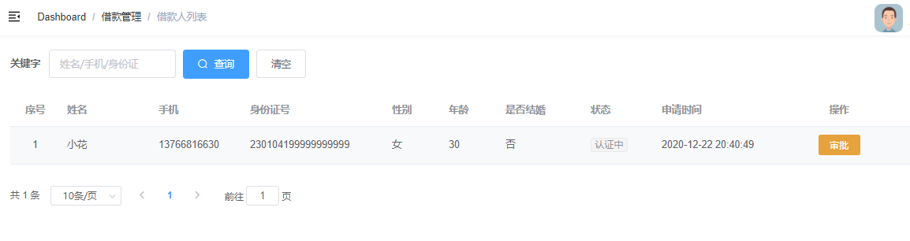
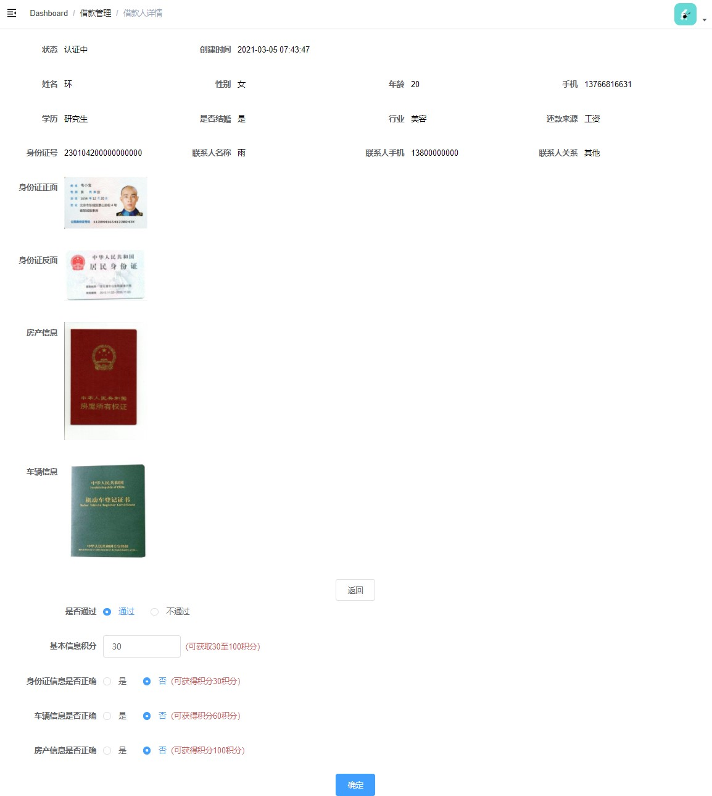

# 借款额度审核


## 审核页面


### 借款人列表




### 借款人详情




# 01-借款列表展示


## 一、前端整合

修改 **srb-admin** 项目


### 1. 路由

修改 **src/router.index.js**，新增路由

```js
  {
    path: "/core/borrowwer",
    component: Layout,
    redirect: '/core/borrower/list',
    meta: { title: '借款管理', icon: 'user' },
    alwaysShow: true,
    children: [
      {
        path: "list",
        name: "借款人列表",
        component: () => import("@/views/core/borrower/list"),
        meta: {title: "借款人列表" }
      },
      {
        path: "detail/:id",
        name: "借款人详情",
        component: () => import("@/views/core/borrower/detail"),
        meta: {title: "借款人详情" },
        hidden: true
      },
    ]
  },
```


### 2. Api

新增 **src/api/core/borrower.js**

```js
import request from '@/utils/request'

export default {
  getPageList(page, limit, keyword) {
    return request({
      url: `/admin/core/borrower/list/${page}/${limit}`,
      method: 'get',
      params: {keyword}
    })
  }
}
```


### 3. 页面

创建 **src/views/core/borrower/list.vue **

```html
<template>
  <div class="app-container">
    <!--查询表单-->
    <el-form :inline="true">
      <el-form-item label="关键字">
        <el-input v-model="keyword" placeholder="姓名/手机/身份证" />
      </el-form-item>
      <el-button type="primary" icon="el-icon-search" @click="fetchDataSearch()">
        查询
      </el-button>
      <el-button type="default" @click="resetData()">
        清空
      </el-button>
    </el-form>

    <!-- 列表 -->
    <el-table :data="list" stripe>
      <el-table-column label="序号" width="70" align="center">
        <template slot-scope="scope">
          {{ (page - 1) * limit + scope.$index + 1 }}
        </template>
      </el-table-column>

      <el-table-column prop="name" label="姓名" />
      <el-table-column prop="mobile" label="手机" />
      <el-table-column prop="idCard" label="身份证号" width="200" />
      <el-table-column label="性别" width="80">
        <template slot-scope="scope">
          {{ scope.row.sex === 1 ? '男' : '女' }}
        </template>
      </el-table-column>

      <el-table-column prop="age" label="年龄" width="80" />

      <el-table-column label="是否结婚" width="120">
        <template slot-scope="scope">
          {{ scope.row.marry ? '是' : '否' }}
        </template>
      </el-table-column>

      <el-table-column label="状态" width="100">
        <template slot-scope="scope">
          <el-tag v-if="scope.row.status === 0" type="info" size="mini">
            未认证
          </el-tag>
          <el-tag v-if="scope.row.status === 1" type="warning" size="mini">
            认证中
          </el-tag>
          <el-tag v-if="scope.row.status === 2" type="success" size="mini">
            认证通过
          </el-tag>
          <el-tag v-if="scope.row.status === -1" type="danger" size="mini">
            认证失败
          </el-tag>
        </template>
      </el-table-column>

      <el-table-column prop="createTime" label="申请时间" width="160" />

      <el-table-column label="操作" width="200" align="center">
        <template slot-scope="scope">
          <router-link :to="'/core/borrower/detail/' + scope.row.id">
            <el-button v-if="scope.row.status === 1" type="warning" size="mini">
              审批
            </el-button>
            <el-button v-else type="primary" size="mini">
              查看
            </el-button>
          </router-link>
        </template>
      </el-table-column>
    </el-table>

    <!-- 分页组件 -->
    <el-pagination
      :current-page="page"
      :total="total"
      :page-size="limit"
      :page-sizes="[2, 10, 20]"
      style="padding: 30px 0; "
      layout="total, sizes, prev, pager, next, jumper"
      @size-change="changePageSize"
      @current-change="changeCurrentPage"
    />
  </div>
</template>
```


### 4. 页面脚本

```js
import borrowerApi from '@/api/core/borrower'

export default {
    data() {
        return {
            list: null,
            keyword: "",
            page: 1,
            total: 0,
            limit: 5
        }
    },

    created() {
        this.fetchData()
     },

    methods: {

        fetchData() {
            borrowerApi.list(this.page, this.limit, this.keyword).then(res => {
                this.list = res.data.pageModel.records
                this.total = res.data.pageModel.total
                this.page = res.data.pageModel.current
                this.limit = res.data.pageModel.size
            })
        },
        
        fetchDataSearch() {
            this.page = 1;
            this.fetchData()
        },

        changePageSize(size) {
            this.limit = size
        },

        changeCurrentPage(page) {
            this.page = page
        },

        resetData() {
            this.keyword = ''
        }
    }

}
```


## 二、后端接口


### 1. Service

**BorrowerService** 接口 添加方法

````java
    /**
     * 分页查询借款人
     * @param pageParam
     * @param keyword
     * @return
     */
    Page<Borrower> getList(Page<Borrower> pageParam, String keyword);
````

实现类：

```java
@Override
public Page<Borrower> getList(Page<Borrower> pageParam, String keyword) {

    if (StringUtils.isEmpty(keyword)) {
        return baseMapper.selectPage(pageParam, null);
    }

    QueryWrapper<Borrower> queryWrapper = new QueryWrapper<>();
    queryWrapper.like("name", keyword)
        .or().like("id_card", keyword)
        .or().like("mobile", keyword)
        .orderByDesc("id");

    return baseMapper.selectPage(pageParam, queryWrapper);
}
```


### 2. Controller

新建 **AdminBorrowerController**

```java
package com.frankeleyn.srb.core.controller.admin;

@RestController
@RequestMapping("/admin/core/borrower")
public class AdminBorrowerController {

    @Autowired
    private BorrowerService borrowerService;

    @GetMapping("/list/{page}/{limit}")
    public R list(@PathVariable("page") Long page, @PathVariable("limit") Long limit, String keyword) {
        Page<Borrower> pageParam = new Page<>();
        pageParam.setCurrent(page);
        pageParam.setSize(limit);

        Page<Borrower> pageModel = borrowerService.getList(pageParam, keyword);
        return R.ok("pageModel", pageModel);
    }
}
```


# 02-借款人信息展示


## 一、前端整合

修改 **srb-admin** 项目


### 1. Api

**src/views/core/borrower/detail.vue** 添加 **show** 方法

```js
show(id) {
    return request({
        url: `/admin/core/borrower/show/${id}`,
        method: "get",
    });
},
```


### 2. 页面

```html
<template>
  <div class="app-container">
 <el-form label-width="100px" class="form-table">
      <el-row>
        <el-col :span="6">
          <el-form-item label="状态">
            {{ borrower.status }}
          </el-form-item>
        </el-col>
        <el-col :span="6">
          <el-form-item label="创建时间">
            {{ borrower.createTime }}
          </el-form-item>
        </el-col>
      </el-row>
      <el-row>
        <el-col :span="6">
          <el-form-item label="姓名">
            {{ borrower.name }}
          </el-form-item>
        </el-col>
        <el-col :span="6">
          <el-form-item label="性别">
            {{ borrower.sex }}
          </el-form-item>
        </el-col>
        <el-col :span="6">
          <el-form-item label="年龄">
            {{ borrower.age }}
          </el-form-item>
        </el-col>
        <el-col :span="6">
          <el-form-item label="手机">
            {{ borrower.mobile }}
          </el-form-item>
        </el-col>
      </el-row>
      <el-row>
        <el-col :span="6">
          <el-form-item label="学历">
            {{ borrower.education }}
          </el-form-item>
        </el-col>
        <el-col :span="6">
          <el-form-item label="是否结婚">
            {{ borrower.marry }}
          </el-form-item>
        </el-col>
        <el-col :span="6">
          <el-form-item label="行业">
            {{ borrower.industry }}
          </el-form-item>
        </el-col>
        <el-col :span="6">
          <el-form-item label="还款来源">
            {{ borrower.returnSource }}
          </el-form-item>
        </el-col>
      </el-row>
      <el-row>
        <el-col :span="6">
          <el-form-item label="身份证号">
            {{ borrower.idCard }}
          </el-form-item>
        </el-col>
        <el-col :span="6">
          <el-form-item label="联系人名称">
            {{ borrower.contactsName }}
          </el-form-item>
        </el-col>
        <el-col :span="6">
          <el-form-item label="联系人手机">
            {{ borrower.contactsMobile }}
          </el-form-item>
        </el-col>
        <el-col :span="6">
          <el-form-item label="联系人关系">
            {{ borrower.contactsRelation }}
          </el-form-item>
        </el-col>
      </el-row>
      <el-row>
        <el-col :span="24">
          <el-form-item label="身份证正面">
            <span v-for="item in borrower.borrowerAttachVOList" :key="item.id">
              <el-image
                v-if="item.imageType == 'idCard1'"
                style="width: 150px;"
                :src="item.imageUrl"
                :preview-src-list="[item.imageUrl]"
              />
            </span>
          </el-form-item>
        </el-col>
      </el-row>
      <el-row>
        <el-col :span="24">
          <el-form-item label="身份证反面">
            <span v-for="item in borrower.borrowerAttachVOList" :key="item.id">
              <el-image
                v-if="item.imageType == 'idCard2'"
                style="width: 150px;"
                :src="item.imageUrl"
                :preview-src-list="[item.imageUrl]"
              />
            </span>
          </el-form-item>
        </el-col>
      </el-row>
      <el-row>
        <el-col :span="24">
          <el-form-item label="房产信息">
            <span v-for="item in borrower.borrowerAttachVOList" :key="item.id">
              <el-image
                v-if="item.imageType == 'house'"
                style="width: 150px;"
                :src="item.imageUrl"
                :preview-src-list="[item.imageUrl]"
              />
            </span>
          </el-form-item>
        </el-col>
      </el-row>
      <el-row>
        <el-col :span="24">
          <el-form-item label="车辆信息">
            <span v-for="item in borrower.borrowerAttachVOList" :key="item.id">
              <el-image
                v-if="item.imageType == 'car'"
                style="width: 150px;"
                :src="item.imageUrl"
                :preview-src-list="[item.imageUrl]"
              />
            </span>
          </el-form-item>
        </el-col>
      </el-row>
      <el-row style="text-align:center">
        <el-button @click="back">
          返回
        </el-button>
      </el-row>
    </el-form>
  </div>
</template>
```


### 3. 页面脚本

**src/views/core/borrower/detail.vue**

```js
// 引入组件
import borrowerApi from "@/api/core/borrower";

export default {
  data() {
    return {
      borrower: {},
      saveBtnDisabled: false,
      approvalForm: {
        borrowerId: 0,
        status: 2,
        content: "",
        infoIntegral: 30,
        isIdCardOk: false,
        isHouseOk: false,
        isCarOk: false,
      },
    };
  },

  created() {
    this.fetchDataById();
  },

  methods: {
      
    fetchDataById() {
      borrowerApi.show(this.$route.params.id).then((res) => {
        this.borrower = res.data.borrower;
      });
    },

    back() {
      this.$router.push("/core/borrower/list");
    },
  },
};
```


## 二、后端接口


### 1. 定义 VO 对象

**BorrowerAttachVO**

```java
package com.frankeleyn.srb.core.pojo.vo;

@Data
@ApiModel(value="借款人附件资料")
public class BorrowerAttachVO {

    @ApiModelProperty(value = "图片类型（idCard1：身份证正面，idCard2：身份证反面，house：房产证，car：车）")
    private String imageType;

    @ApiModelProperty(value = "图片路径")
    private String imageUrl;
}
```

**BorrowerDetailVO**

```java
package com.frankeleyn.srb.core.pojo.vo;

@Data
@ApiModel(description="借款人信息详情")
public class BorrowerDetailVO {

    @ApiModelProperty(value = "用户id")
    private Long userId;

    @ApiModelProperty(value = "姓名")
    private String name;

    @ApiModelProperty(value = "身份证号")
    private String idCard;

    @ApiModelProperty(value = "手机")
    private String mobile;

    @ApiModelProperty(value = "性别")
    private String sex;

    @ApiModelProperty(value = "年龄")
    private Integer age;

    @ApiModelProperty(value = "学历")
    private String education;

    @ApiModelProperty(value = "是否结婚")
    private String marry;

    @ApiModelProperty(value = "行业")
    private String industry;

    @ApiModelProperty(value = "月收入")
    private String income;

    @ApiModelProperty(value = "还款来源")
    private String returnSource;

    @ApiModelProperty(value = "联系人名称")
    private String contactsName;

    @ApiModelProperty(value = "联系人手机")
    private String contactsMobile;

    @ApiModelProperty(value = "联系人关系")
    private String contactsRelation;

    @ApiModelProperty(value = "审核状态")
    private String status;

    @ApiModelProperty(value = "创建时间")
    private LocalDateTime createTime;

    @ApiModelProperty(value = "借款人附件资料")
    private List<BorrowerAttachVO> borrowerAttachVOList;
}
```


### 2. Service

**DictService**

```java
    /**
     * 根据 dict_code 和 value 查询字典名
     * @param dictCode
     * @param value
     * @return
     */
    String getNameByDictCodeAndValue(String dictCode, Integer value);
```

实现类：

```java
@Override
public String getNameByDictCodeAndValue(String dictCode, Integer value) {
    Dict parent = baseMapper.selectOne(new QueryWrapper<Dict>().eq("dict_code", dictCode));

    Dict dict = baseMapper.selectOne(new QueryWrapper<Dict>()
                                     .eq("parent_id", parent.getId())
                                     .eq("value", value));

    return dict.getName();
}
```


**BorrowerAttachService**

```java
    /**
     * 根据 BorrowerId 查询 用户上传附件
     * @param id
     * @return
     */
    List<BorrowerAttachVO> selectBorrowerAttachVOList(Long id);
```

实现类：

```java
public List<BorrowerAttachVO> selectBorrowerAttachVOList(Long id) {
    QueryWrapper<BorrowerAttach> borrowerAttachQueryWrapper = new QueryWrapper<>();
    borrowerAttachQueryWrapper.eq("borrower_id", id);
    List<BorrowerAttach> borrowerAttachList = baseMapper.selectList(borrowerAttachQueryWrapper);

    List<BorrowerAttachVO> borrowerAttachVOList = new ArrayList<>();
    borrowerAttachList.forEach(borrowerAttach -> {
        BorrowerAttachVO borrowerAttachVO = new BorrowerAttachVO();
        borrowerAttachVO.setImageType(borrowerAttach.getImageType());
        borrowerAttachVO.setImageUrl(borrowerAttach.getImageUrl());

        borrowerAttachVOList.add(borrowerAttachVO);
    });

    return borrowerAttachVOList;
}
```


**BorrowerService**

```java
    /**
     * 查询单个借款人的审核信息
     * @param id
     * @return
     */
    BorrowerDetailVO getBorrowerDetailVOById(Long id);
```

实现类

```java
@Autowired
private DictService dictService;

@Autowired
private BorrowerAttachService borrowerAttachService;

public BorrowerDetailVO getBorrowerDetailVOById(Long id) {
    BorrowerDetailVO detailVO = new BorrowerDetailVO();

    // 填充借款人信息
    Borrower borrower = baseMapper.selectById(id);
    BeanUtils.copyProperties(borrower, detailVO);
    detailVO.setStatus(BorrowerStatusEnum.getMsgByStatus(borrower.getStatus())); // 状态
    detailVO.setSex(borrower.getSex() == 1? "男" : "女"); // 性别
    detailVO.setMarry(borrower.getMarry() ? "已婚" : "未婚");

    // 填充字典信息
    String industry = dictService.getNameByDictCodeAndValue("industry", borrower.getIndustry());
    String income = dictService.getNameByDictCodeAndValue("income", borrower.getIncome());
    String returnSource = dictService.getNameByDictCodeAndValue("returnSource", borrower.getReturnSource());
    String relation = dictService.getNameByDictCodeAndValue("relation", borrower.getContactsRelation());
    String education = dictService.getNameByDictCodeAndValue("education", borrower.getEducation());

    detailVO.setEducation(education);
    detailVO.setIndustry(industry);
    detailVO.setIncome(income);
    detailVO.setReturnSource(returnSource);
    detailVO.setContactsRelation(relation);

    // 查询附件列表
    List<BorrowerAttachVO> borrowerAttachVOList = borrowerAttachService.selectBorrowerAttachVOList(id);
    detailVO.setBorrowerAttachVOList(borrowerAttachVOList);

    return detailVO;
}
```


### 3. Controller

**AdminBorrowerController**

```java
@GetMapping("/show/{id}")
public R show(@PathVariable("id") Long id) {
    BorrowerDetailVO borrowerDetailVO = borrowerService.getBorrowerDetailVOById(id);
    return R.ok("borrower", borrowerDetailVO);
}
```


# 03-借款额度审核


## 一、前端整合

修改 **srb-admin** 项目


### 1. Api

**src/api/core/borrower.js**

```java
approval(borrowerApproval) {
    return request({
        url: "/admin/core/borrower/approval",
        method: "post",
        data: borrowerApproval,
    });
},
```


### 2. 页面

**src/views/core/borrower/detail.vue**

```html
<el-form label-width="170px" v-if="borrower.status === '认证中'">
      <el-form-item label="是否通过">
        <el-radio-group v-model="approvalForm.status">
          <el-radio :label="2">
            通过
          </el-radio>
          <el-radio :label="-1">
            不通过
          </el-radio>
        </el-radio-group>
      </el-form-item>

      <el-form-item v-if="approvalForm.status == 2" label="基本信息积分">
        <el-input v-model="approvalForm.infoIntegral" style="width: 140px;" />
        <span style="color: indianred">（可获取30至100积分）</span>
      </el-form-item>

      <el-form-item v-if="approvalForm.status == 2" label="身份证信息是否正确">
        <el-radio-group v-model="approvalForm.isIdCardOk">
          <el-radio :label="true">
            是
          </el-radio>
          <el-radio :label="false">
            否
          </el-radio>
        </el-radio-group>
        <span style="color: indianred">（可获得积分30积分）</span>
      </el-form-item>

      <el-form-item v-if="approvalForm.status == 2" label="车辆信息是否正确">
        <el-radio-group v-model="approvalForm.isCarOk">
          <el-radio :label="true">
            是
          </el-radio>
          <el-radio :label="false">
            否
          </el-radio>
        </el-radio-group>
        <span style="color: indianred">（可获得积分60积分）</span>
      </el-form-item>

      <el-form-item v-if="approvalForm.status == 2" label="房产信息是否正确">
        <el-radio-group v-model="approvalForm.isHouseOk">
          <el-radio :label="true">
            是
          </el-radio>
          <el-radio :label="false">
            否
          </el-radio>
        </el-radio-group>
        <span style="color: indianred">（可获得积分100积分）</span>
      </el-form-item>

      <el-row style="text-align:center">
        <el-button type="primary" @click="approvalSubmit()">
          确定
        </el-button>
      </el-row>
    </el-form>
```


### 3. 页面脚本

```java
approvalSubmit() {
    this.approvalForm.borrowerId = this.$route.params.id
        borrowerApi.approval(this.approvalForm).then(res => {
        this.$message.success(res.message)
            this.back()
    })
},
```


## 二、后端接口

### 1. VO

**BorrowerApprovalVO**

```java
package com.frankeleyn.srb.core.pojo.vo;

@Data
@ApiModel(description = "借款人审批")
public class BorrowerApprovalVO {

    @ApiModelProperty(value = "id")
    private Long borrowerId;

    @ApiModelProperty(value = "状态")
    private Integer status;

    @ApiModelProperty(value = "身份证信息是否正确")
    private Boolean isIdCardOk;

    @ApiModelProperty(value = "房产信息是否正确")
    private Boolean isHouseOk;

    @ApiModelProperty(value = "车辆信息是否正确")
    private Boolean isCarOk;

    @ApiModelProperty(value = "基本信息积分")
    private Integer infoIntegral;
}
```


### 2. Service

**BorrowerService**

```java
    /**
     * 审核
     * @param approvalVO
     */
    void approval(BorrowerApprovalVO approvalVO);
```

实现类：

```java
    @Resource
    private UserIntegralMapper userIntegralMapper;

    @Override
    public void approval(BorrowerApprovalVO approvalVO) {

        Borrower borrower = baseMapper.selectById(approvalVO.getBorrowerId());
        Long userId = borrower.getUserId();
        UserInfo userInfo = userInfoMapper.selectById(userId);

        // 保存 user_integral
        Boolean isHouseOk = approvalVO.getIsHouseOk();
        Boolean isCarOk = approvalVO.getIsCarOk();
        Boolean isIdCardOk = approvalVO.getIsIdCardOk();
        Integer infoIntegral = approvalVO.getInfoIntegral();

        // 总积分
        int countIntegral = userInfo.getIntegral();

        // 基本积分
        countIntegral += infoIntegral;
        UserIntegral userIntegral = new UserIntegral();
        userIntegral.setUserId(userId);
        userIntegral.setIntegral(infoIntegral);
        userIntegral.setContent("基本积分");
        userIntegralMapper.insert(userIntegral);

        // 房子积分
        if(isHouseOk) {
            countIntegral += IntegralEnum.BORROWER_HOUSE.getIntegral();
            UserIntegral userIntegralHouse = new UserIntegral();
            userIntegralHouse.setUserId(userId);
            userIntegralHouse.setIntegral(IntegralEnum.BORROWER_HOUSE.getIntegral());
            userIntegralHouse.setContent(IntegralEnum.BORROWER_HOUSE.getMsg());
            userIntegralMapper.insert(userIntegralHouse);
        }

        // 车子积分
        if(isCarOk) {
            countIntegral += IntegralEnum.BORROWER_CAR.getIntegral();
            UserIntegral userIntegralCar = new UserIntegral();
            userIntegralCar.setUserId(userId);
            userIntegralCar.setIntegral(IntegralEnum.BORROWER_CAR.getIntegral());
            userIntegralCar.setContent(IntegralEnum.BORROWER_CAR.getMsg());
            userIntegralMapper.insert(userIntegralCar);
        }

        // 身份证积分
        if(isIdCardOk) {
            countIntegral += IntegralEnum.BORROWER_IDCARD.getIntegral();
            UserIntegral userIntegralIdCard = new UserIntegral();
            userIntegralIdCard.setUserId(userId);
            userIntegralIdCard.setIntegral(IntegralEnum.BORROWER_IDCARD.getIntegral());
            userIntegralIdCard.setContent(IntegralEnum.BORROWER_IDCARD.getMsg());
            userIntegralMapper.insert(userIntegralIdCard);
        }

        // 修改 user_info
        userInfo.setBorrowAuthStatus(BorrowerStatusEnum.AUTH_OK.getStatus());
        userInfo.setIntegral(countIntegral);
        userInfo.setBorrowAuthStatus(approvalVO.getStatus());
        userInfoMapper.updateById(userInfo);

        // 修改 审核状态
        borrower.setStatus(approvalVO.getStatus());
        baseMapper.updateById(borrower);
    }
```


### 3. Controller

**AdminBorrowerController**

```java
@PostMapping("/approval")
public R approval(@RequestBody BorrowerApprovalVO approvalVO) {
    borrowerService.approval(approvalVO);
    return R.ok("审核成功");
}
```

