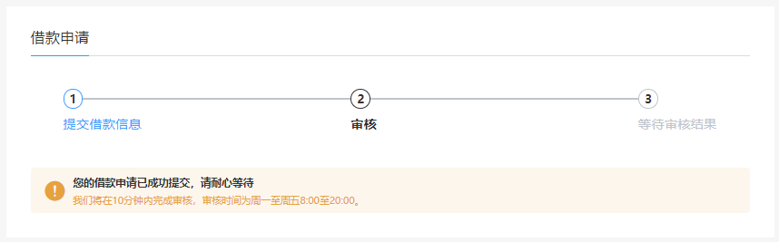
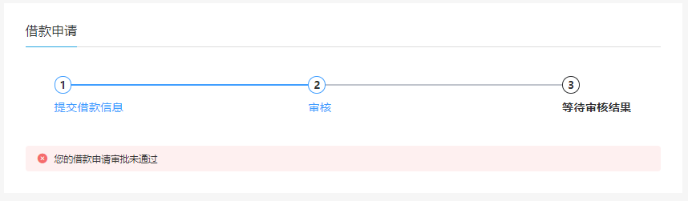

# 借款申请


## 业务流程

① 点击 **我要借款**


② 展示借款信息填写页面


③ 填写完信息，等待审核


审核成功：





# 01-获取借款额度


## 一、前端整合

修改 **srb-site** 项目


### 1. 页面

修改 **pages/user/borrower.vue**

```html
<NuxtLink to="/user/apply" v-if="borrowerStatus === 2">
  <el-button style="margin-top:20px;" type="success">
    我要借款
  </el-button>
</NuxtLink>
```

新建 **pages/user/apply.vue**

```html
<template>
  <div class="personal-main">
    <div class="personal-pay">
      <h3><i>借款申请</i></h3>

      <el-steps :active="active" style="margin: 40px">
        <el-step title="提交借款信息"></el-step>
        <el-step title="审核"></el-step>
        <el-step title="等待审核结果"></el-step>
      </el-steps>

      <div v-if="active === 0" class="user-borrower">
        <el-form label-width="120px">
          <el-form-item label="借款金额">
            <el-col :span="6">
              <el-input v-model="borrowInfo.amount" />
            </el-col>
            <el-col :span="6">
              &nbsp;&nbsp;您最多可借款{{ borrowAmount }}元
            </el-col>
          </el-form-item>

          <el-form-item label="期数">
            <el-select v-model="borrowInfo.period">
              <el-option :value="1" label="1个月" />
              <el-option :value="3" label="3个月" />
              <el-option :value="6" label="6个月" />
              <el-option :value="9" label="9个月" />
              <el-option :value="12" label="12个月" />
              <el-option :value="24" label="24个月" />
            </el-select>
          </el-form-item>

          <el-form-item label="还款方式">
            <el-select v-model="borrowInfo.returnMethod">
              <el-option
                v-for="item in returnMethodList"
                :key="item.value"
                :label="item.name"
                :value="item.value"
              />
            </el-select>
          </el-form-item>
          <el-form-item label="资金用途">
            <el-select v-model="borrowInfo.moneyUse">
              <el-option
                v-for="item in moneyUseList"
                :key="item.value"
                :label="item.name"
                :value="item.value"
              />
            </el-select>
          </el-form-item>
          <el-form-item label="年利率">
            <el-col :span="6">
              <el-input v-model="borrowInfo.borrowYearRate">
                <template slot="append">%</template>
              </el-input>
            </el-col>
            <el-col :span="8">
              &nbsp;&nbsp;年利率越高，借款越容易成功。
            </el-col>
          </el-form-item>
          <el-form-item>
            <el-button
              type="primary"
              :disabled="submitBtnDisabled"
              @click="save"
            >
              提交
            </el-button>
          </el-form-item>
        </el-form>
        <el-alert
          title="您提供的任何信息尚融宝都承诺予以保护，不会挪作他用。"
          type="warning"
          :closable="false"
        >
        </el-alert>
      </div>

      <div v-if="active === 1">
        <div style="margin-top:40px;">
          <el-alert
            title="您的借款申请已成功提交，请耐心等待"
            type="warning"
            show-icon
            :closable="false"
          >
            我们将在10分钟内完成审核，审核时间为周一至周五8:00至20:00。
          </el-alert>
        </div>
      </div>

      <div v-if="active === 2">
        <div style="margin-top:40px;">
          <el-alert
            v-if="borrowInfoStatus === 2"
            title="您的借款申请审批已通过"
            type="success"
            show-icon
            :closable="false"
          >
          </el-alert>

          <el-alert
            v-if="borrowInfoStatus === -1"
            title="您的借款申请审批未通过"
            type="error"
            show-icon
            :closable="false"
          >
          </el-alert>
        </div>
      </div>
    </div>
  </div>
</template>

<script>
export default {
  data() {
    return {
      active: 0, //步骤
      borrowInfoStatus: null, //审批状态
      //借款申请
      borrowInfo: {
        borrowYearRate: "12",
      },
      borrowAmount: 0, //借款额度
      submitBtnDisabled: false,
      returnMethodList: [], //还款方式列表
      moneyUseList: [], //资金用途列表
    };
  },
};
</script>
```


### 2. 页面脚本

**pages/user/apply.vue**

```js
  created() {
      this.getBorrowAmount()
      this.initSelect()
  },

  methods: {
    getBorrowAmount() {
        this.$axios.$get('/api/core/borrowInfo/auth/getBorrowAmount').then(res => {
            this.borrowAmount = res.data.borrowAmount
        })
    },
        
    // 获取初始化下拉列表
    initSelect() {
      this.$axios
        .$get("/api/core/dict/findByDictCode/returnMethod")
        .then((res) => {
          this.returnMethodList = res.data.list;
        });

      this.$axios
        .$get("/api/core/dict/findByDictCode/moneyUse")
        .then((res) => {
          this.moneyUseList = res.data.list;
        });
    },
  }

  // 持续检查借款人输入的金额，不能超过借款金额
  watch: {
      'borrowInfo.amount'(value) {
          if(value > this.borrowAmount) {
              let _this = this;
              this.$alert('您的借款额度不足', {
                type : 'error',
                callback() {
                    _this.borrowInfo.amount = _this.borrowAmount
                }
              })
          }
      }
  }
```


## 二、后端接口


### 1. Service

**BorrowInfoService** 接口

```java
    /**
     * 根据用户 id 获取借款金额
     * @param userId
     * @return
     */
    BigDecimal getBorrowAmount(Long userId);
```

实现类

```java
public BigDecimal getBorrowAmount(Long userId) {
    // 通过 userId 获取用户积分
    UserInfo userInfo = userInfoMapper.selectById(userId);
    Integer integral = userInfo.getIntegral();

    // 根据用户积分获取用户额度
    QueryWrapper<IntegralGrade> integralQueryWrapper = new QueryWrapper<>();
    integralQueryWrapper.le("integral_start", integral)
        .gt("integral_end", integral);
    IntegralGrade integralGrade = integralGradeMapper.selectOne(integralQueryWrapper);

    return integralGrade.getBorrowAmount();
}
```


### 2. Controller

新建 **ApiBorrowInfoController**

```java
package com.frankeleyn.srb.core.controller.api;

@RestController
@RequestMapping("/api/core/borrowInfo")
public class ApiBorrowInfoController {

    @Autowired
    private BorrowInfoService borrowInfoService;

    @GetMapping("/auth/getBorrowAmount")
    public R getBorrowAmount(HttpServletRequest request) {
        String token = request.getHeader("token");
        Assert.notNull(token, ResponseEnum.LOGIN_AUTH_ERROR);

        Long userId = JwtUtils.getUserId(token);
        Assert.notNull(userId, ResponseEnum.WEIXIN_FETCH_USERINFO_ERROR);

        BigDecimal borrowAmount = borrowInfoService.getBorrowAmount(userId);
        return R.ok("borrowAmount", borrowAmount);
    }
}
```


# 02-提交借款申请


## 一、前端整合

修改 **srb-site** 项目

**pages/user/apply.vue**

```java
    // 提交借款申请
    save() {
      this.submitBtnDisabled = true;
      this.$axios
        .$post("/api/core/borrowInfo/auth/save", this.borrowInfo)
        .then((res) => {
          this.$message.success(res.message);
          this.active = 1;
        });
    },
```


## 二、后端接口


### 1. Service

**BorrowInfoService** 接口

```java
    /**
     * 提交借款申请
     * @param borrowInfo
     * @param userId
     */
    void saveBorrowInfo(BorrowInfo borrowInfo, Long userId);
```

实现类：

```java
    public void saveBorrowInfo(BorrowInfo borrowInfo, Long userId) {
        // 获取用户信息
        UserInfo userInfo = userInfoMapper.selectById(userId);

        // 装配 borrowInfo 信息
        borrowInfo.setBorrowYearRate( borrowInfo.getBorrowYearRate().divide(new BigDecimal(100)));
        borrowInfo.setUserId(userId);
        borrowInfo.setStatus(BorrowInfoStatusEnum.CHECK_RUN.getStatus());
        baseMapper.insert(borrowInfo);
    }
```


### 2. Controller

**ApiBorrowInfoController**

```java
    @PostMapping("/auth/save")
	public R save(@RequestBody BorrowInfo borrowInfo, HttpServletRequest request) {
        String token = request.getHeader("token");
        Assert.notNull(token, ResponseEnum.LOGIN_AUTH_ERROR);

        Long userId = JwtUtils.getUserId(token);
        Assert.notNull(userId, ResponseEnum.WEIXIN_FETCH_USERINFO_ERROR);

        borrowInfoService.saveBorrowInfo(borrowInfo, userId);
        return R.ok().message("提交成功");
    }
```


# 03-获取借款状态


## 一、前端整合

修改 **srb-site** 项目

**pages/user/apply.vue**

```java
  mounted() {
    this.getBorrowInfoStatus();
  },

  methods: {
    // 获取借款状态
    getBorrowInfoStatus() {
      this.$axios
        .$get("/api/core/borrowInfo/auth/getBorrowInfoStatus")
        .then((res) => {
          this.borrowInfoStatus = res.data.borrowInfoStatus;
          console.log("res => " + this.borrowInfoStatus);

          if (this.borrowInfoStatus == 0) {
            this.active = 0;
            this.getBorrowAmount();
            this.initSelect();
          }

          if (this.borrowInfoStatus == 1) {
            this.active = 1;
          }

          if (this.borrowInfoStatus == 2) {
            this.active = 2;
          }

          if (this.borrowInfoStatus == -1) {
            this.active = -1;
          }
        });

    },
```


## 二、后端接口


### 1. Service

**BorrowInfoService **

```java
    /**
     * 根据 userId 查询借款状态
     * @param userId
     * @return
     */
    Integer getBorrowInfoStatus(Long userId);
```

实现类

```java
    public Integer getBorrowInfoStatus(Long userId) {
        BorrowInfo borrowInfo = baseMapper.selectOne(new QueryWrapper<BorrowInfo>().eq("user_id", userId));

        if (Objects.isNull(borrowInfo)) {
            return 0;
        }

        return borrowInfo.getStatus();
    }
```

