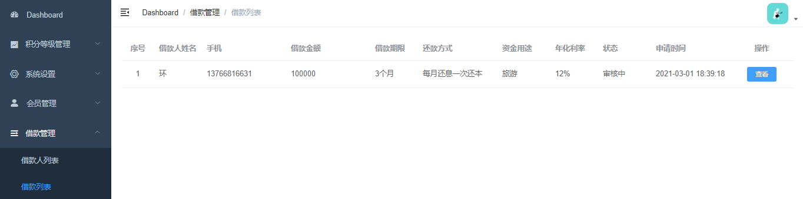

# 借款审核


# 01-借款信息列表




## 一、前端整合

修改 **srb-admin** 项目


### 1. 路由

修改 **src/router/index.js**

```js
          {
            path: 'info-list',
            name: 'coreBorrowInfoList',
            component: () => import('@/views/core/borrow-info/list'),
            meta: { title: '借款列表' }
          },
          {
            path: 'info-detail/:id',
            name: 'coreBorrowInfoDetail',
            component: () => import('@/views/core/borrow-info/detail'),
            meta: { title: '借款详情' },
            hidden: true
          }
```


### 2. Api

添加 **src/api/core/borrow-info.js**

```js
import request from '@/utils/request'

export default {
  getList() {
    return request({
      url: `/admin/core/borrowInfo/list`,
      method: 'get'
    })
  }
}
```


### 3. 页面

新建 **src/views/core/borrow-info.vue**

```html
<template>
  <div class="app-container">
    <!-- 列表 -->
    <el-table :data="list" stripe>
      <el-table-column type="index" label="序号" width="60" align="center" />
      <el-table-column prop="name" label="借款人姓名" width="90" />
      <el-table-column prop="mobile" label="手机" />
      <el-table-column prop="amount" label="借款金额" />
      <el-table-column label="借款期限" width="90">
        <template slot-scope="scope">{{ scope.row.period }}个月</template>
      </el-table-column>
      <el-table-column prop="param.returnMethod" label="还款方式" width="150" />
      <el-table-column prop="param.moneyUse" label="资金用途" width="100" />
      <el-table-column label="年化利率" width="90">
        <template slot-scope="scope">
          {{ scope.row.borrowYearRate * 100 }}%
        </template>
      </el-table-column>
      <el-table-column prop="param.status" label="状态" width="100" />

      <el-table-column prop="createTime" label="申请时间" width="150" />

      <el-table-column label="操作" width="150" align="center">
        <template slot-scope="scope">
          <el-button type="primary" size="mini">
            <router-link :to="'/core/borrower/info-detail/' + scope.row.id">
              查看
            </router-link>
          </el-button>

          <el-button
            v-if="scope.row.status === 1"
            type="warning"
            size="mini"
            @click="approvalShow(scope.row)"
          >
            审批
          </el-button>
        </template>
      </el-table-column>
    </el-table>
  </div>
</template>

<script>
import borrowInfoApi from '@/api/core/borrow-info'

export default {
  data() {
    return {
      list: null // 列表
    }
  },

  created() {
    this.fetchData()
  },

  methods: {
    // 加载列表数据
    fetchData() {
    }
  }
}
</script>
```


### 4. 页面脚本

修改 **src/views/core/borrow-info.vue**

```js
import borrowInfoApi from '@/api/core/borrow-info'

export default {
  data() {
    return {
      list: null // 列表
    }
  },

  created() {
    this.fetchData()
  },

  methods: {
    // 加载列表数据
    fetchData() {
      borrowInfoApi.getList().then(response => {
        this.list = response.data.list
      })
    }
  }
}
```


## 二、后端接口


### 1. 扩展实体类

在 **BorrowInfo** 类中扩展以下字段

```java
@ApiModelProperty(value = "姓名")
@TableField(exist = false)
private String name;

@ApiModelProperty(value = "手机")
@TableField(exist = false)
private String mobile;

@ApiModelProperty(value = "其他参数")
@TableField(exist = false)
private Map<String,Object> param = new HashMap<>();
```


### 2. Service

**BorrowInfoService**

```java
    /**
     * 查询所有借款信息
     * @return
     */
    List<BorrowInfo> getList();
```

实现类：

```java
@Override
public List<BorrowInfo> getList() {

    List<BorrowInfo> borrowInfoList = baseMapper.selectList(null);
    borrowInfoList.forEach(borrowInfo -> {
        // 查询还款方式，资金用户信息
        UserInfo userInfo = userInfoMapper.selectById(borrowInfo.getUserId());
        String returnMethod = dictService.getNameByDictCodeAndValue("returnMethod", borrowInfo.getReturnMethod());
        String moneyUse = dictService.getNameByDictCodeAndValue("moneyUse", borrowInfo.getMoneyUse());
        String status = BorrowInfoStatusEnum.getMsgByStatus(borrowInfo.getStatus());

        borrowInfo.getParam().put("returnMethod", returnMethod);
        borrowInfo.getParam().put("moneyUse", moneyUse);
        borrowInfo.getParam().put("status", status);
        borrowInfo.setName(userInfo.getName());
        borrowInfo.setMobile(userInfo.getMobile());
    });

    return borrowInfoList;
}
```


### 3. Controller

新增 **AdminBorrowInfoController**

```java
package com.frankeleyn.srb.core.controller.admin;

@RestController
@RequestMapping("/admin/core/borrowInfo")
public class AdminBorrowInfoController {

    @Autowired
    private BorrowInfoService borrowInfoService;

    @GetMapping("/list")
    public R getList() {
        List<BorrowInfo> borrowInfoList = borrowInfoService.getList();
        return R.ok("list", borrowInfoList);
    }
}
```


# 02-借款详情


## 一、前端整合

修改 **srb-admin** 项目


### 1. Api

**src/api/core/borrow-info.js**

```js
  show(id) {
    return request({
      url: `/admin/core/borrowInfo/show/${id}`,
      method: 'get'
    })
  }
```


### 2. 页面

**src/views/core/borro-info/detail.vue**

```html
<template>
  <div class="app-container">
    <h4>借款信息</h4>
    <table
      class="table table-striped table-condenseda table-bordered"
      width="100%"
    >
      <tbody>
        <tr>
          <th width="15%">借款金额</th>
          <td width="35%">{{ borrowInfoDetail.borrowInfo.amount }}元</td>
          <th width="15%">借款期限</th>
          <td width="35%">{{ borrowInfoDetail.borrowInfo.period }}个月</td>
        </tr>
        <tr>
          <th>年化利率</th>
          <td>{{ borrowInfoDetail.borrowInfo.borrowYearRate * 100 }}%</td>
          <th>还款方式</th>
          <td>{{ borrowInfoDetail.borrowInfo.param.returnMethod }}</td>
        </tr>

        <tr>
          <th>资金用途</th>
          <td>{{ borrowInfoDetail.borrowInfo.param.moneyUse }}</td>
          <th>状态</th>
          <td>{{ borrowInfoDetail.borrowInfo.param.status }}</td>
        </tr>
        <tr>
          <th>创建时间</th>
          <td>{{ borrowInfoDetail.borrowInfo.createTime }}</td>
          <th></th>
          <td></td>
        </tr>
      </tbody>
    </table>

    <h4>借款人信息</h4>
    <table
      class="table table-striped table-condenseda table-bordered"
      width="100%"
    >
      <tbody>
        <tr>
          <th width="15%">借款人</th>
          <td width="35%">
            <b>{{ borrowInfoDetail.borrower.name }}</b>
          </td>
          <th width="15%">手机</th>
          <td width="35%">{{ borrowInfoDetail.borrower.mobile }}</td>
        </tr>
        <tr>
          <th>身份证</th>
          <td>{{ borrowInfoDetail.borrower.idCard }}</td>
          <th>性别</th>
          <td>{{ borrowInfoDetail.borrower.sex }}</td>
        </tr>
        <tr>
          <th>年龄</th>
          <td>{{ borrowInfoDetail.borrower.age }}</td>
          <th>是否结婚</th>
          <td>{{ borrowInfoDetail.borrower.marry }}</td>
        </tr>
        <tr>
          <th>学历</th>
          <td>{{ borrowInfoDetail.borrower.education }}</td>
          <th>行业</th>
          <td>{{ borrowInfoDetail.borrower.industry }}</td>
        </tr>
        <tr>
          <th>月收入</th>
          <td>{{ borrowInfoDetail.borrower.income }}</td>
          <th>还款来源</th>
          <td>{{ borrowInfoDetail.borrower.returnSource }}</td>
        </tr>
        <tr>
          <th>创建时间</th>
          <td>{{ borrowInfoDetail.borrower.createTime }}</td>
          <th>状态</th>
          <td>{{ borrowInfoDetail.borrower.status }}</td>
        </tr>
      </tbody>
    </table>

    <el-row style="text-align: center; margin-top: 40px">
      <el-button @click="back"> 返回 </el-button>
    </el-row>
  </div>
</template>
```


### 3. 页面脚本

**src/views/core/borro-info/detail.vue**

```js
import borrowInfoApi from '@/api/core/borrow-info'

export default {
  data() {
    return {
      borrowInfoDetail: {
        borrowInfo: {
          param: {},
        },
        borrower: {},
      },
    };
  },

  created() {
      this.fetchDataById()
  },

  methods: {
    fetchDataById() {
        borrowInfoApi.show(this.$route.params.id).then(res => {
            this.borrowInfoDetail = res.data.borrowInfoDetail
        })
    },

    back() {
      this.$router.push("/core/borrower/info-list");
    },
  },
};
```


## 二、后端接口


### 1. Service

**BorrowInfoService** 接口

```java
    /**
     * 查询借款信息
     * @param id
     * @return
     */
    Map<String, Object> show(Long id);
```

实现类：

```java
@Override
public Map<String, Object> show(Long id) {
    // 查询借款信息
    BorrowInfo borrowInfo = baseMapper.selectById(id);
    String returnMethod = dictService.getNameByDictCodeAndValue("returnMethod", borrowInfo.getReturnMethod());
    String moneyUse = dictService.getNameByDictCodeAndValue("moneyUse", borrowInfo.getMoneyUse());
    String status = BorrowInfoStatusEnum.getMsgByStatus(borrowInfo.getStatus());
    // 装配数据
    borrowInfo.getParam().put("returnMethod", returnMethod);
    borrowInfo.getParam().put("moneyUse", moneyUse);
    borrowInfo.getParam().put("status", status);

    // 查询借款人信息
    Borrower borrower = borrowerMapper.selectOne(new QueryWrapper<Borrower>().eq("user_id", borrowInfo.getUserId()));
    BorrowerDetailVO borrowerDetail = borrowerService.getBorrowerDetailVOById(borrower.getId());

    // 封装结果
    Map<String, Object> resultMap = new HashMap<>();
    resultMap.put("borrower", borrowerDetail);
    resultMap.put("borrowInfo", borrowInfo);
    return resultMap;
}
```


### 2. Controller

**AdminBorrowInfoController**

```java
@GetMapping("/show/{id}")
public R show(@PathVariable("id") Long id) {
    Map<String, Object> borrowInfoDetail = borrowInfoService.show(id);
    return R.ok("borrowInfoDetail", borrowInfoDetail);
}
```


# 03-借款审批


## 一、前端整合

修改 **srb-admin** 项目


### 1. Api

```js
  approval(borrowInfoApproval) {
    return request({
        url: '/admin/core/borroweInfo/approval',
        method: 'post',
        data: borrowInfoApproval
    })
  },
```


### 2. 页面

**src/views/core/borrow-info/list.vue**

```html
<!-- 审批对话框 -->
<el-dialog title="审批" :visible.sync="dialogVisible" width="490px">
    <el-form label-position="right" label-width="100px">
        <el-form-item label="是否通过">
            <el-radio-group v-model="borrowInfoApproval.status">
                <el-radio :label="2">通过</el-radio>
                <el-radio :label="-1">不通过</el-radio>
            </el-radio-group>
        </el-form-item>

        <el-form-item v-if="borrowInfoApproval.status == 2" label="标的名称">
            <el-input v-model="borrowInfoApproval.title" />
        </el-form-item>

        <el-form-item v-if="borrowInfoApproval.status == 2" label="起息日">
            <el-date-picker
                            v-model="borrowInfoApproval.lendStartDate"
                            type="date"
                            placeholder="选择开始时间"
                            value-format="yyyy-MM-dd"
                            />
        </el-form-item>

        <el-form-item v-if="borrowInfoApproval.status == 2" label="年化收益率">
            <el-input v-model="borrowInfoApproval.lendYearRate">
                <template slot="append">%</template>
            </el-input>
        </el-form-item>

        <el-form-item v-if="borrowInfoApproval.status == 2" label="服务费率">
            <el-input v-model="borrowInfoApproval.serviceRate">
                <template slot="append">%</template>
            </el-input>
        </el-form-item>

        <el-form-item v-if="borrowInfoApproval.status == 2" label="标的描述">
            <el-input v-model="borrowInfoApproval.lendInfo" type="textarea" />
        </el-form-item>
    </el-form>
    <div slot="footer" class="dialog-footer">
        <el-button @click="dialogVisible = false">
            取消
        </el-button>
        <el-button type="primary" @click="approvalSubmit">
            确定
        </el-button>
    </div>
</el-dialog>
```


### 3. 页面脚本

**src/views/core/borrow-info/list.vue**

```js
export default {
  data() {
    return {
      list: null, // 列表
      dialogVisible: false, //审批对话框
      borrowInfoApproval: { //审批对象
        status: 2,
        serviceRate: 5,
        lendYearRate: 0, //初始化，解决表单中数据修改时无法及时渲染的问题
      }, 
    };
  },

  created() {
    this.fetchData();
  },

  methods: {
    approvalShow(row) {
      this.dialogVisible = true;
      this.borrowInfoApproval.id = row.id;
      this.borrowInfoApproval.lendYearRate = row.borrowYearRate * 100;
    },

    approvalSubmit() {
      borrowInfoApi.approval(this.borrowInfoApproval).then((response) => {
        this.dialogVisible = false;
        this.$message.success(response.message);
        this.fetchData();
      });
    },

  },
};
```


## 二、后端接口


### 1. Service

**BorrowInfoService**

```java
    /**
     * 借款审核
     * @param approvalVO
     */
    void approval(BorrowInfoApprovalVO approvalVO);
```

实现类：

```java
@Override
public void approval(BorrowInfoApprovalVO approvalVO) {
    // 更新借款信息状态
    Long borrowerInfoId = approvalVO.getId();
    BorrowInfo borrowInfo = baseMapper.selectById(borrowerInfoId);
    borrowInfo.setStatus(approvalVO.getStatus());
    baseMapper.updateById(borrowInfo);

    // 调用标的接口
    System.out.println("调用标的接口，生成标的");
    //lendService.createLend("参数");
}
```


### 2. Controller

**AdminBorrowInfoController**

```java
@PostMapping("/approval")
public R approval(@RequestBody BorrowInfoApprovalVO approvalVO) {
    borrowInfoService.approval(approvalVO);
    return R.ok("审核成功");
}
```

