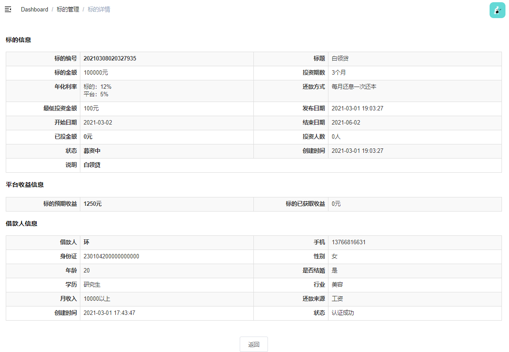

# 标的管理


# 01-生成新标的

当借款审核通过后，就需要进行生成标的


## 后端接口


### 1.Service

**LendService ** 接口：

```java
    /**
     * 创建标的
     * @param approvalVO
     * @param borrowInfo
     */
    void createLend(BorrowInfoApprovalVO approvalVO, BorrowInfo borrowInfo);
```

实现类：

```java
@Override
public void createLend(BorrowInfoApprovalVO approvalVO, BorrowInfo borrowInfo) {
    Lend lend = new Lend();

    lend.setStatus(LendStatusEnum.INVEST_RUN.getStatus()); // 标的状态
    lend.setRealAmount(new BigDecimal(0));  // 标的实际募资
    lend.setInvestAmount(new BigDecimal(0)); // 投资金额
    lend.setInvestNum(0);   // 投资人数
    lend.setReturnMethod(borrowInfo.getReturnMethod()); // 还款方式
    lend.setTitle(approvalVO.getTitle()); // 标的标题
    lend.setLendInfo(approvalVO.getLendInfo()); // 标的信息
    lend.setUserId(borrowInfo.getUserId());
    lend.setPublishDate(LocalDateTime.now()); // 标的发布时间
    LocalDate startDate = LocalDate.parse(approvalVO.getLendStartDate(), DateTimeFormatter.ofPattern("yyyy-MM-dd"));
    lend.setLendStartDate(startDate); // 标的起息时间
    LocalDate endDate = startDate.plusMonths(borrowInfo.getPeriod());
    lend.setLendEndDate(endDate); // 标的结束日期 = 起息日期 + 借款期数
    lend.setPeriod(borrowInfo.getPeriod()); // 标的的期数
    lend.setLowestAmount(new BigDecimal(100)); // 最低投资金额
    lend.setLendYearRate(borrowInfo.getBorrowYearRate()); // 投资年利率
    lend.setServiceRate(approvalVO.getServiceRate().divide(new BigDecimal(100))); // 服务费率
    lend.setAmount(borrowInfo.getAmount()); // 标的总额
    lend.setLendNo(LendNoUtils.getLendNo()); // 标的单号
    lend.setCreateTime(LocalDateTime.now());
    lend.setCheckTime(LocalDateTime.now());
    lend.setCheckAdminId(1L);
    lend.setBorrowInfoId(borrowInfo.getId());

    // 平台收益 = 月服务费率 * 标的总额 * 期数
    BigDecimal serviceMonthRate = lend.getServiceRate().divide(new BigDecimal(12), 8, BigDecimal.ROUND_HALF_DOWN);
    BigDecimal expectAmount = lend.getAmount().multiply(serviceMonthRate).multiply(new BigDecimal(borrowInfo.getPeriod()));
    lend.setExpectAmount(expectAmount);

    baseMapper.insert(lend);
}
```


修改 **BorrowInfoService** 实现类：

```java
@Override
public void approval(BorrowInfoApprovalVO approvalVO) {
    // 更新借款信息状态
    Long borrowerInfoId = approvalVO.getId();
    BorrowInfo borrowInfo = baseMapper.selectById(borrowerInfoId);
    borrowInfo.setStatus(approvalVO.getStatus());
    baseMapper.updateById(borrowInfo);

    // 调用标的接口
    System.out.println("调用标的接口，生成标的");
    lendService.createLend(approvalVO, borrowInfo);
}
```


# 02-标的列表


## 一、前端整合

修改 **srb-admin** 项目


### 1. 路由

**src/router/index.js**

```js
  {
    path: '/core/lend',
    component: Layout,
    name: 'coreLend',
    meta: { title: '标的管理', icon: 'el-icon-s-flag' },
    alwaysShow: true,
    children: [
      {
        path: 'list',
        name: 'coreLendList',
        component: () => import('@/views/core/lend/list'),
        meta: { title: '标的列表' }
      },
      {
        path: 'detail/:id',
        name: 'coreLendDetail',
        component: () => import('@/views/core/lend/detail'),
        meta: { title: '标的详情' },
        hidden: true
      }
    ]
  },
```


### 2. Api

创建 **src/api/core/lend.js**

```js
import request from '@/utils/request'

export default {
  getList() {
    return request({
      url: `/admin/core/lend/list`,
      method: 'get'
    })
  }
}
```


### 3. 页面

创建 **src/views/core/lend/list.vue**

```html
<template>
  <div class="app-container">
    <!-- 列表 -->
    <el-table :data="list" stripe>
      <el-table-column type="index" label="序号" width="60" align="center" />
      <el-table-column prop="lendNo" label="标的编号" width="160" />
      <el-table-column prop="amount" label="标的金额" />
      <el-table-column prop="period" label="投资期数" />
      <el-table-column label="年化利率">
        <template slot-scope="scope">
          {{ scope.row.lendYearRate * 100 }}%
        </template>
      </el-table-column>
      <el-table-column prop="investAmount" label="已投金额" />
      <el-table-column prop="investNum" label="投资人数" />
      <el-table-column prop="publishDate" label="发布时间" width="150" />
      <el-table-column prop="lendStartDate" label="开始日期" />
      <el-table-column prop="lendEndDate" label="结束日期" />
      <el-table-column prop="param.returnMethod" label="还款方式" />
      <el-table-column prop="param.status" label="状态" />

      <el-table-column label="操作" width="150" align="center">
        <template slot-scope="scope">
          <el-button type="primary" size="mini">
            <router-link :to="'/core/lend/detail/' + scope.row.id">
              查看
            </router-link>
          </el-button>

          <el-button
            v-if="scope.row.status == 1"
            type="warning"
            size="mini"
            @click="makeLoan(scope.row.id)"
          >
            放款
          </el-button>
        </template>
      </el-table-column>
    </el-table>
  </div>
</template>
```


### 4. 页面脚本

**src/views/core/lend/list.vue**

```js
import lendApi from '@/api/core/lend'

export default {
  data() {
    return {
      list: null // 列表
    }
  },

  created() {
    this.fetchData()
  },

  methods: {
    // 加载列表数据
    fetchData() {
      lendApi.getList().then(response => {
        this.list = response.data.list
      })
    }
  }
}
```


## 二、后端接口


### 1. 扩展实体对象

在 **Lend** 类中添加下面的字段：

```java
@ApiModelProperty(value = "其他参数")
@TableField(exist = false)
private Map<String,Object> param = new HashMap<>();
```


### 2. Service

**LendService** 接口：

```java
    /**
     * 查询标的
     * @return
     */
    List<Lend> getList();
```

实现类：

```java
    @Override
    public List<Lend> getList() {
        List<Lend> lendList = baseMapper.selectList(null);

        lendList.forEach(lend -> {
            String returnMethod = dictService.getNameByDictCodeAndValue("returnMethod", lend.getReturnMethod());
            String status = LendStatusEnum.getMsgByStatus(lend.getStatus());
            lend.getParam().put("returnMethod", returnMethod);
            lend.getParam().put("status", status);
        });
        
        return lendList;
    }
```


### 3. Controller

新建 **AdminLendController**

```java
package com.frankeleyn.srb.core.controller.admin;

@RestController
@RequestMapping("/admin/core/lend")
public class AdminLendController {

    @Autowired
    private LendService lendService;

    @GetMapping("/list")
    public R getList() {
        List<Lend> lendList = lendService.getList();
        return R.ok("list", lendList);
    }
}
```


# 03-标的详情




## 一、前端整合

修改 **srb-admin** 项目


### 1. Api

修改 **src/api/core/lend.js**

```js
show(id) {
    return request({
        url: `/admin/core/lend/show/${id}`,
        method: "get",
    });
},
```


### 2. 页面

新建 **src/views/core/lend/detail.vue**

```html
<template>
  <div class="app-container">
    <h4>标的信息</h4>
    <table
      class="table table-striped table-condenseda table-bordered"
      width="100%"
    >
      <tbody>
        <tr>
          <th width="15%">标的编号</th>
          <td width="35%">
            <b>{{ lendDetail.lend.lendNo }}</b>
          </td>
          <th width="15%">标题</th>
          <td width="35%">{{ lendDetail.lend.title }}</td>
        </tr>
        <tr>
          <th>标的金额</th>
          <td>{{ lendDetail.lend.amount }}元</td>
          <th>投资期数</th>
          <td>{{ lendDetail.lend.period }}个月</td>
        </tr>
        <tr>
          <th>年化利率</th>
          <td>
            标的：{{ lendDetail.lend.lendYearRate * 100 }}%
            <br />
            平台：{{ lendDetail.lend.serviceRate * 100 }}%
          </td>
          <th>还款方式</th>
          <td>{{ lendDetail.lend.param.returnMethod }}</td>
        </tr>

        <tr>
          <th>最低投资金额</th>
          <td>{{ lendDetail.lend.lowestAmount }}元</td>
          <th>发布日期</th>
          <td>{{ lendDetail.lend.publishDate }}</td>
        </tr>
        <tr>
          <th>开始日期</th>
          <td>{{ lendDetail.lend.lendStartDate }}</td>
          <th>结束日期</th>
          <td>{{ lendDetail.lend.lendEndDate }}</td>
        </tr>
        <tr>
          <th>已投金额</th>
          <td>
            <b>{{ lendDetail.lend.investAmount }}元</b>
          </td>
          <th>投资人数</th>
          <td>{{ lendDetail.lend.investNum }}人</td>
        </tr>
        <tr>
          <th>状态</th>
          <td>
            <b>{{ lendDetail.lend.param.status }}</b>
          </td>
          <th>创建时间</th>
          <td>{{ lendDetail.lend.createTime }}</td>
        </tr>
        <tr>
          <th>说明</th>
          <td colspan="3">
            <b>{{ lendDetail.lend.lendInfo }}</b>
          </td>
        </tr>
      </tbody>
    </table>
      
    <h4>平台收益信息</h4>
    <table
      class="table table-striped table-condenseda table-bordered"
      width="100%"
    >
      <tbody>
        <tr>
          <th width="15%">标的预期收益</th>
          <td width="35%">
            <b>{{ lendDetail.lend.expectAmount }}元</b>
          </td>
          <th width="15%">标的已获取收益</th>
          <td width="35%">{{ lendDetail.lend.realAmount }}元</td>
        </tr>
      </tbody>
    </table>

    <h4>借款人信息</h4>
    <table
      class="table table-striped table-condenseda table-bordered"
      width="100%"
    >
      <tbody>
        <tr>
          <th width="15%">借款人</th>
          <td width="35%">
            <b>{{ lendDetail.borrower.name }}</b>
          </td>
          <th width="15%">手机</th>
          <td width="35%">{{ lendDetail.borrower.mobile }}</td>
        </tr>
        <tr>
          <th>身份证</th>
          <td>{{ lendDetail.borrower.idCard }}</td>
          <th>性别</th>
          <td>{{ lendDetail.borrower.sex }}</td>
        </tr>
        <tr>
          <th>年龄</th>
          <td>{{ lendDetail.borrower.age }}</td>
          <th>是否结婚</th>
          <td>{{ lendDetail.borrower.marry }}</td>
        </tr>
        <tr>
          <th>学历</th>
          <td>{{ lendDetail.borrower.education }}</td>
          <th>行业</th>
          <td>{{ lendDetail.borrower.industry }}</td>
        </tr>
        <tr>
          <th>月收入</th>
          <td>{{ lendDetail.borrower.income }}</td>
          <th>还款来源</th>
          <td>{{ lendDetail.borrower.returnSource }}</td>
        </tr>
        <tr>
          <th>创建时间</th>
          <td>{{ lendDetail.borrower.createTime }}</td>
          <th>状态</th>
          <td>{{ lendDetail.borrower.status }}</td>
        </tr>
      </tbody>
    </table>

    <el-row style="text-align:center;margin-top: 40px;">
      <el-button @click="back">
        返回
      </el-button>
    </el-row>
  </div>
</template>
```


### 3. 页面脚本

**src/views/core/lend/detail.vue**

```js
import lendApi from '@/api/core/lend'
import '@/styles/show.css'

export default {
  data() {
    return {
      lendDetail: {
        lend: {
          param: {}
        },
        borrower: {}
      }
    }
  },

  created() {
    if (this.$route.params.id) {
      this.fetchDataById()
    }
  },

  methods: {
    fetchDataById() {
        lendApi.show(this.$route.params.id).then(res => {
            this.lendDetail = res.data.lendDetail
        })
    },

    back() {
      this.$router.push({ path: '/core/lend/list' })
    }
  }
}
```


## 二、后端接口


### 1. Service

**LendService**

```java
    /**
     * 查询单个标的信息
     * @param id
     * @return
     */
    Map<String, Object> show(Long id);
```

实现类：

```java
@Override
public Map<String, Object> show(Long id) {
    Map<String, Object> resultMap = new HashMap<>();

    // 查询 lend
    Lend lend = baseMapper.selectById(id);
    String returnMethod = dictService.getNameByDictCodeAndValue("returnMethod", lend.getReturnMethod());
    String status = LendStatusEnum.getMsgByStatus(lend.getStatus());
    lend.getParam().put("returnMethod", returnMethod);
    lend.getParam().put("status", status);

    // 查询 borrower
    Long userId = lend.getUserId();
    Borrower borrower = borrowerMapper.selectOne(new QueryWrapper<Borrower>().eq("user_id", userId));
    BorrowerDetailVO borrowerDetail = borrowerService.getBorrowerDetailVOById(borrower.getId());

    resultMap.put("borrower", borrowerDetail);
    resultMap.put("lend", lend);
    return resultMap;
}
```


### 2. Controller

**AdminLendController**

```java
@GetMapping("/show/{id}")
public R show(@PathVariable("id") Long id) {
    Map<String, Object> lendDetail = lendService.show(id);
    return R.ok("lendDetail", lendDetail);
}
```

