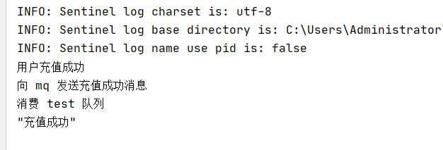

# 整合 RabbitMQ


## 一、创建 service-mq 模块


### 1. 新建 service-mq 模块


### 2. 引入依赖

```xml
<dependencies>

    <dependency>
        <groupId>org.springframework.boot</groupId>
        <artifactId>spring-boot-starter-amqp</artifactId>
    </dependency>

    <dependency>
        <groupId>com.alibaba</groupId>
        <artifactId>fastjson</artifactId>
    </dependency>

    <dependency>
        <groupId>org.projectlombok</groupId>
        <artifactId>lombok</artifactId>
    </dependency>

</dependencies>
```


### 3. 创建 MQConfig

```java
package com.frankeleyn.srb.rabbitUtil.config;

@Configuration
public class MQConfig {

    @Bean
    public MessageConverter messageConverter(){
        //json字符串转换器
        return new Jackson2JsonMessageConverter();
    }
}
```


### 4. 创建 MQService

如果其他微服务需要发送消息队列，引入 **service-mq**，调用 MQService 接口即可。

**MqService** 接口：

```java
package com.frankeleyn.srb.rabbitUtil.service;

public interface MqService {

    /**
     * 发送消息
     * @param exchange 交换机
     * @param routingKey 路由
     * @param message 消息
     */
    boolean sendMessage(String exchange, String routingKey, Object message);
}
```

实现类：

```java
package com.frankeleyn.srb.rabbitUtil.service.impl;

@Service
public class MqServiceImpl implements MqService {

    @Autowired
    private RabbitTemplate rabbitTemplate;

    @Override
    public boolean sendMessage(String exchange, String routingKey, Object message) {
        rabbitTemplate.convertAndSend(exchange, routingKey, message);
        return true;
    }
}
```


## 二、创建测试 MQ 模块

将 **service-mq** 引入，测试一下能否使用


### 1. 新建 service-mqtest 模块


### 2. 引入依赖

```xml
    <dependencies>

        <dependency>
            <groupId>com.frankeleyn</groupId>
            <artifactId>service-base</artifactId>
            <version>1.0</version>
        </dependency>

        <dependency>
            <groupId>com.frankeleyn</groupId>
            <artifactId>service-mq</artifactId>
            <version>1.0</version>
        </dependency>

    </dependencies>
```


### 3. 配置文件

```properties
server.port=8210

spring.application.name=service-mqtest

# ========== rabbitmq 配置 ==========
spring.rabbitmq.host=192.168.209.125
spring.rabbitmq.port=5672
spring.rabbitmq.username=admin
spring.rabbitmq.password=123456
spring.rabbitmq.virtual-host=/
```


### 4. 启动类

```java
package com.frankeleyn.srb.mqtest;

@EnableFeignClients
@EnableDiscoveryClient
@SpringBootApplication(exclude = DataSourceAutoConfiguration.class)
@ComponentScan(basePackages = {"com.frankeleyn.srb","com.frankeleyn.common"})
public class ServiceMQTestApplication {

    public static void main(String[] args) {
        SpringApplication.run(ServiceMQTestApplication.class, args);
    }
}
```


### 5. Service

**TestService** 接口：

```java
package com.frankeleyn.srb.mqtest.service;

public interface TestService {

    /**
     * 发送充值消息
     */
    void recharge();
}

```

实现类：

````java
package com.frankeleyn.srb.mqtest.service.impl;

@Service
public class TestServiceImpl implements TestService {

    @Autowired
    MqService mqService;

    @Override
    public void recharge() {
        System.out.println("用户充值成功");
        mqService.sendMessage("exchange.test", "routing.test", "充值成功");
        System.out.println("向 mq 发送充值成功消息");
    }
}
````


### 6. Controller

新建 **TestController**

```java
package com.frankeleyn.srb.mqtest.controller;

@RestController
public class TestController {

    @Autowired
    TestService testService;

    @GetMapping("/recharge")
    public R recharge() {
        testService.recharge();
        return R.ok();
    }
}
```


### 7. 新建消费者

```java
package com.frankeleyn.srb.mqtest.receiver;

@Component
public class ConsumerTest {

    @RabbitListener(bindings = @QueueBinding(
            exchange = @Exchange(value = "exchange.test"),
            key = {"routing.test"},
            value = @Queue(value = "queue.test", durable = "true")
    ))
    public void receive(Message message) {
        System.out.println("消费 test 队列");
        System.out.println(new String(message.getBody()));
    }

}
```


### 8. 运行

访问 **http://localhost:8210/recharge**




## 三、Service-core 中发送消息


### 1. Service-base 中新建 DTO

创建 **SmsDTO**

```java
@Data
@ApiModel(description = "短信")
public class SmsDTO {

    @ApiModelProperty(value = "手机号")
    private String mobile;

    @ApiModelProperty(value = "消息内容")
    private String message;
}
```


### 2. 引入依赖

```xml
        <dependency>
            <groupId>com.frankeleyn</groupId>
            <artifactId>service-mq</artifactId>
            <version>1.0</version>
        </dependency>
```


### 3. 配置文件

```properties
# ========== rabbitmq 配置 ==========
spring.rabbitmq.host=192.168.209.125
spring.rabbitmq.port=5672
spring.rabbitmq.username=admin
spring.rabbitmq.password=123456
spring.rabbitmq.virtual-host=/
```


### 4. 修改 Service

修改 **UserAccountService** 实现类中的 **notified** 方法，加上下面两句

```java
// 通过 MQ 调用短信系统，发送充值成功通知
SmsDTO smsDTO = new SmsDTO(userInfo.getMobile(), "充值成功");
mqService.sendMessage(MQConst.EXCHANGE_TOPIC_SMS, MQConst.ROUTING_SMS_ITEM, smsDTO);
```


## 四、service-sms 接收消息


### 1. 引入依赖

```xml
        <dependency>
            <groupId>com.frankeleyn</groupId>
            <artifactId>service-mq</artifactId>
            <version>1.0</version>
        </dependency>
```


### 2. 配置文件

```properties
# ========== rabbitmq 配置 ==========
spring.rabbitmq.host=192.168.209.125
spring.rabbitmq.port=5672
spring.rabbitmq.username=admin
spring.rabbitmq.password=123456
spring.rabbitmq.virtual-host=/
```


### 3. 创建 MQ 监听器

```java
package com.frankeleyn.srb.sms.receiver;

@Component
@Slf4j
public class SmsReceiver {

    @Resource
    private SmsService smsService;

    @RabbitListener(bindings = @QueueBinding(
            exchange = @Exchange(value = MQConst.EXCHANGE_TOPIC_SMS),
            value = @Queue(value = MQConst.QUEUE_SMS_ITEM, durable = "true"),
            key = {MQConst.ROUTING_SMS_ITEM}
    ))
    public void send(SmsDTO smsDTO) {
        System.out.println("消费消息，发送充值成功短信");
    }
}
```

