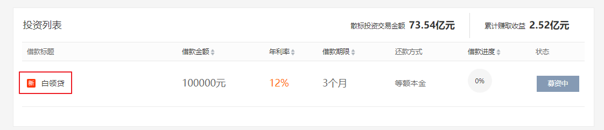

# 投标


## 业务流程

#### ① 点击标的，进入标的详情



#### ② 输入投资金额，计算投资收益

#### ③ 同意协议，点击立即投资


#### ④ 支付后回调

(1) 更改账户金额

(2) 新增投资状态

(3) 更新标的信息

(4) 添加交易流水


# 01-标的详情


## 一、前端整合

修改 **srb-site** 项目


### 1. 页面模板

新建 **pages/lend/_id.vue**

```html
<template>
  <!--信息详细-->
  <div class="item-detail wrap">
    <div class="breadcrumbs">
      <a href="/">首页</a>&gt; <a href="/lend">散标投资列表</a>&gt;
      <span class="cur">项目详情</span>
    </div>
    <div class="item-detail-head clearfix" data-target="sideMenu">
      <div class="hd">
        <i class="icon icon-xin"></i>
        <h2 style="width:70%">{{ lend.title }}</h2>
      </div>

      <!-- 标的信息开始 -->
      <div class="bd clearfix">
        <div class="data" style="width: auto;">
          <ul>
            <li>
              <span class="f16">借款金额</span><br />
              <span class="f30 c-333">{{ lend.amount }}</span>
              元
            </li>
            <li class="relative">
              <span class="f16">年利率</span><br />
              <span class="f30 c-orange">{{ lend.lendYearRate * 100 }}% </span>
            </li>
            <li>
              <span class="f16">借款期限</span><br />
              <span class="f30 c-333">{{ lend.period }}</span>
              个月
            </li>
            <li><span class="c-888">借款编号：</span>{{ lend.lendNo }}</li>
            <li>
              <span class="c-888">借款时间：</span>
              {{ lend.lendStartDate }}至{{ lend.lendEndDate }}
            </li>
            <li>
              <span class="c-888">还款方式：</span>{{ lend.param.returnMethod }}
            </li>
            <li class="colspan" style="line-height: 60px;">
              <span class="c-888 fl">投标进度：</span>
              <div class="progress-bar fl" style="margin-top:26px;">
                <span
                  :style="
                    'width:' + (lend.investAmount / lend.amount) * 100 + '%'
                  "
                ></span>
              </div>
              <span class="c-orange">
                {{ (lend.investAmount / lend.amount) * 100 }}%
              </span>
              <span>
                已有{{ lend.investNum }}人投资{{ lend.investAmount }}元
              </span>
            </li>
          </ul>
        </div>
      </div>
      <!-- 标的信息开始 -->

      <!-- 投资表单开始 -->
      <div v-if="userType === 1 && lend.status === 1" class="bd clearfix">
        <div class="data" style="width: auto;">
          <el-form :inline="true" class="demo-form-inline">
            <el-form-item label="投资金额">
              <el-input
                v-model="invest.investAmount"
                :disabled="lend.status != 1"
                @blur="getInterestCount()"
              >
                <template slot="append">元</template>
              </el-input>
            </el-form-item>
            <el-form-item label="您将获得收益">
              <span class="c-orange">{{ interestCount }}</span>
              元
            </el-form-item>
            <el-form-item>
              <el-checkbox v-model="agree">同意</el-checkbox>
              <span class="orange">
                <a href="#">《出借协议》</a>
              </span>
              <el-button
                type="warning"
                @click="commitInvest"
                :disabled="!agree"
              >
                立即投资
              </el-button>
            </el-form-item>
          </el-form>
          <p>
            您的账户余额 <span class="c-orange">{{ account }}</span> 元，
            <a href="/user/recharge" class="c-888">马上充值</a>
          </p>
        </div>
      </div>
      <!-- 投资表单结束 -->
    </div>

    <!-- 投资记录 -->
    <div class="item-detail-body clearfix mrt30 ui-tab">
      <div class="ui-tab-nav hd">
        <ul>
          <li class="nav_li active">
            <a href="javascript:;">投资记录</a>
          </li>
        </ul>
      </div>
      <div class="bd">
        <div class="ui-tab-item active" style="display: block;">
          <div class="repayment-list">
            <table border="0" cellpadding="0" cellspacing="0" width="100%">
              <tbody>
                <tr>
                  <th>投标人</th>
                  <th>投标金额</th>
                  <th>投标时间</th>
                </tr>
              </tbody>
              <tbody id="repayment_content">
                <tr v-for="lendItem in lendItemList" :key="lendItem.id">
                  <td>{{ lendItem.investName }}</td>
                  <td>
                    <span class="c-orange">￥{{ lendItem.investAmount }}</span>
                  </td>
                  <td>{{ lendItem.investTime }}</td>
                </tr>
              </tbody>
            </table>
          </div>
        </div>
      </div>
    </div>

    <!-- 借款和借款人信息 -->
    <div class="item-detail-body clearfix mrt30 ui-tab">
      <div class="ui-tab-nav hd">
        <ul>
          <li class="nav_li active">
            <a href="javascript:;">借款信息</a>
          </li>
        </ul>
      </div>
      <div class="bd">
        <div class="ui-tab-item active" style="display: block;">
          <div class="borrow-info" style="width:auto;">
            <dl class="item">
              <dt>
                <h3>项目介绍</h3>
              </dt>
              <dd>
                <div class="text">
                  <p class="MsoNormal" style="margin-left:0cm;text-indent:0cm;">
                    {{ lend.lendInfo }}
                  </p>
                </div>
              </dd>
            </dl>

            <dl class="item">
              <dt>
                <h3>借款人信息</h3>
              </dt>
              <dd>
                <div class="text">
                  <p class="MsoNormal" style="margin-left:0cm;text-indent:0cm;">
                    姓名：{{ borrower.name }} <br />
                    手机号码：{{ borrower.mobile }} <br />
                    身份认证：已认证 <br />
                    注册时间：{{ borrower.createTime }} <br />
                  </p>
                </div>
              </dd>
            </dl>

            <dl class="item">
              <dt>
                <h3>审核信息</h3>
              </dt>
              <dd>
                <div class="verify clearfix" style="width: auto;">
                  <ul>
                    <li>
                      <i class="icon icon-4"></i><br />
                      身份证
                    </li>
                    <li>
                      <i class="icon icon-5"></i><br />
                      户口本
                    </li>
                    <li>
                      <i class="icon icon-6"></i><br />
                      结婚证
                    </li>
                    <li>
                      <i class="icon icon-7"></i><br />
                      工作证明
                    </li>
                    <li>
                      <i class="icon icon-8"></i><br />
                      工资卡流水
                    </li>
                    <li>
                      <i class="icon icon-9"></i><br />
                      收入证明
                    </li>
                    <li>
                      <i class="icon icon-10"></i><br />
                      征信报告
                    </li>
                    <li>
                      <i class="icon icon-11"></i><br />
                      亲属调查
                    </li>
                    <li>
                      <i class="icon icon-19"></i><br />
                      行驶证
                    </li>
                    <li>
                      <i class="icon icon-20"></i><br />
                      车辆登记证
                    </li>
                    <li>
                      <i class="icon icon-21"></i><br />
                      车辆登记发票
                    </li>
                    <li>
                      <i class="icon icon-22"></i><br />
                      车辆交强险
                    </li>
                    <li>
                      <i class="icon icon-23"></i><br />
                      车辆商业保险
                    </li>
                    <li>
                      <i class="icon icon-24"></i><br />
                      车辆评估认证
                    </li>
                  </ul>
                </div>
              </dd>
            </dl>
            <dl class="item">
              <dt>
                <h3>风控步骤</h3>
              </dt>
              <dd>
                <div class="text">
                  <p class="MsoNormal" style="margin-left:0cm;text-indent:0cm;">
                    调查：风控部对借款人各项信息进行了全面的电话征信，一切资料真实可靠。<span
                    ></span>
                  </p>
                  <p class="MsoNormal" style="margin-left:0cm;text-indent:0cm;">
                    抵押物：全款长安福特福克斯汽车，车牌号：川<span>AYY***</span>，新车购买于<span>2013</span>年，裸车价<span>14</span>万，评估价<span>5</span>万。
                  </p>
                  <p class="MsoNormal" style="margin-left:0cm;text-indent:0cm;">
                    权证：汽车已入库、已办理相关手续等。
                  </p>
                  <p class="MsoNormal" style="margin-left:0cm;text-indent:0cm;">
                    担保：质押物担保。
                  </p>
                  <p class="MsoNormal" style="margin-left:0cm;text-indent:0cm;">
                    结论：此客户为老客户，上笔贷款<span>4</span>万元，标的号为<span>20200745682</span>，已结清，现因资金周转，再次申请贷款。借款人居住稳定，收入来源可靠，经风控综合评估，同意放款<span>4</span>万。
                  </p>
                  <p class="MsoNormal" style="margin-left:0cm;text-indent:0cm;">
                    保障：借款逾期<span>48</span>小时内，易贷风险准备金先行垫付。
                  </p>
                </div>
                <div class="step clearfix">
                  <ul>
                    <li><i class="icon icon-1"></i>资料审核</li>
                    <li><i class="icon icon-2"></i>实地调查</li>
                    <li><i class="icon icon-3"></i>资产评估</li>
                    <li class="no"><i class="icon icon-4"></i>发布借款</li>
                  </ul>
                </div>
              </dd>
            </dl>
          </div>
        </div>
      </div>
    </div>
  </div>
</template>
```


### 2. 页面脚本

页面信息初始化：

```js
import '~/assets/css/index.css'
import '~/assets/css/detail.css'
import cookie from 'js-cookie'

export default {
  data() {
    return {
      account: 0, //账户余额
      agree: false, //是否同意协议
      invest: {
        lendId: 0, //标的id
        investAmount: 100, //投资金额
      },
      interestCount: 0, //将获得收益
      userType: 0, //用户类型
      lendItemList:[], //投标信息集合
    }
  },
  
  created() {
      this.getUserType();
      this.getUserAccount();
  },

  methods: {
      // 获取用户余额
      getUserAccount() {
          this.$axios.$get('/api/core/userAccount/auth/getAccount').then(res => {
              this.account = res.data.account
          })
      },

      // 获取用户类型
      getUserType() {
          let userInfoStr = cookie.get('userInfo')
          if(null != userInfoStr && userInfoStr != '') {
            let userInfo = JSON.parse(userInfoStr)
            this.userType = userInfo['userType']
          }
      }
  },

  // 标的详情 
  async asyncData({$axios, params}) {
    let response = await $axios.$get('/api/core/lend/show/' + params.id)

    return {
        lend: response.data.lendDetail.lend,
        borrower: response.data.lendDetail.borrower
    }
  }

}
```


## 二、后端接口


### 1. Controller

**ApiUserAccountController**

```java
@GetMapping("/auth/getAccount")
public R getAccount(HttpServletRequest request) {
    String token = request.getHeader("token");
    Assert.notNull(token, ResponseEnum.LOGIN_AUTH_ERROR);
    Long userId = JwtUtils.getUserId(token);
    Assert.notNull(userId, ResponseEnum.LOGIN_AUTH_ERROR);

    BigDecimal account = userAccountService.getAccount(userId);
    return R.ok("account", account);
}
```


### 2. Service

**UserAccountService**

```java
    /**
     * 获取账户余额
     * @param userId
     * @return
     */
    BigDecimal getAccount(Long userId);
```

实现类：

```java
@Override
public BigDecimal getAccount(Long userId) {
    UserAccount userAccount = baseMapper.selectOne(new QueryWrapper<UserAccount>().eq("user_id", userId));
    return userAccount.getAmount();
}
```


# 02-计算收益


## 一、前端整合

修改 **srb-site** 项目


**pages/lend/_id.vue**

```js
// 计算收益
getInterestCount() {
    if(null != this.invest.investAmount &&
       this.invest.investAmount != '' &&
       this.invest.investAmount % 100 == 0 ){
        this.$axios.$get(`/api/core/lend/getInterestCount/${this.invest.investAmount}/${this.lend.lendYearRate}/${this.lend.period}/${this.lend.returnMethod}`)
            .then(res => {
            this.interestCount = res.data.interestCount
        })

    }else{
        alert("请输入100的整数倍")
    }
},
```


## 二、后端接口


### 1. 定义枚举

**ReturnMethodEnum**

```java
package com.frankeleyn.srb.core.enums;

@AllArgsConstructor
@Getter
public enum ReturnMethodEnum {

    ONE(1, "等额本息"),
    TWO(2, "等额本金"),
    THREE(3, "每月还息一次还本"),
    FOUR(4, "一次还本还息"),
    ;

    private Integer method;
    private String msg;
}
```


### 2. Controller

**ApiLendController**

```java
@GetMapping("/getInterestCount/{investAmount}/{lendYearRate}/{period}/{returnMethod}")
public R getInterestCount(@PathVariable("investAmount") BigDecimal investAmount, 
                          @PathVariable("lendYearRate") BigDecimal lendYearRate,
                          @PathVariable("period") Integer period, 
                          @PathVariable("returnMethod") Integer returnMethod) {
    BigDecimal interestCount = lendService.getInterestCount(investAmount, lendYearRate, period, returnMethod);
    return R.ok("interestCount", interestCount);
}
```


### 3. Service

**LnedService**

```java
    /**
     * 查询投资收益
     * @param investAmount 投资金额
     * @param lendYearRate 年利率
     * @param period 借款期数
     * @param returnMethod 借款方式
     * @return
     */
    BigDecimal getInterestCount(BigDecimal investAmount, BigDecimal lendYearRate, Integer period, Integer returnMethod);
```

实现类：

```java
@Override
public BigDecimal getInterestCount(BigDecimal investAmount, BigDecimal lendYearRate, Integer period, Integer returnMethod) {

    BigDecimal interestCount = new BigDecimal("0");

    int r = returnMethod.intValue();

    if (r == ReturnMethodEnum.ONE.getMethod()) {
        // 等额本息
        interestCount = Amount1Helper.getInterestCount(investAmount, lendYearRate, period);
    }

    if (r == ReturnMethodEnum.TWO.getMethod()) {
        // 等额本金
        interestCount = Amount2Helper.getInterestCount(investAmount, lendYearRate, period);
    }

    if (r == ReturnMethodEnum.THREE.getMethod()) {
        // 按期付息
        interestCount = Amount3Helper.getInterestCount(investAmount, lendYearRate, period);
    }

    if (r == ReturnMethodEnum.FOUR.getMethod()) {
        // 还本付息
        interestCount = Amount4Helper.getInterestCount(investAmount, lendYearRate, period);
    }

    return interestCount;
}
```


# 03-投标


## 一、前端整合

修改 **srb-site** 项目


**pages/lend/_id.vue**

```js
// 投标
commitInvest() {
    this.$alert('您即将前往汇付宝','前往汇付宝资金托管平台', {
        dangerouslyUseHTMLString: true,
        confirmButtonText: "立即前往",
        callback: action => {
            if(action == 'confirm') {
                this.invest.lendId = this.$route.params.id
                this.$axios.$post('/api/core/lendItem/auth/commitInvest', this.invest)
                    .then(res => {
                    document.write(res.data.formStr)
                })
            }
        }
    })
},
```


## 二、后端接口


### 1. VO

创建 **InvestVO**

```java
package com.frankeleyn.srb.core.pojo.vo;

@Data
@ApiModel(description = "投标信息")
public class InvestVO {

    private Long lendId;

    //投标金额
    private String investAmount;

    //用户id
    private Long investUserId;

    //用户姓名
    private String investName;
}
```


### 2. Controller

新建 **ApiLendItemController**

```java
package com.frankeleyn.srb.core.controller.api;

@RestController
@RequestMapping("/api/core/lendItem")
public class ApiLendItemController {

    @Autowired
    private LendItemService lendItemService;

    @PostMapping("/auth/commitInvest")
    public R commitInvest(@RequestBody InvestVO investVO, HttpServletRequest request) {
        String token = request.getHeader("token");
        Assert.notNull(token, ResponseEnum.LOGIN_AUTH_ERROR);
        Long userId = JwtUtils.getUserId(token);
        Assert.notNull(userId, ResponseEnum.LOGIN_AUTH_ERROR);

        investVO.setInvestUserId(userId);

        String formStr = lendItemService.commitInvest(investVO);
        return R.ok("formStr", formStr);
    }
}
```


### 3. Service

**LendItemService**

```java
    /**
     * 提交投资
     * @param investVO
     * @return
     */
    String commitInvest(InvestVO investVO);
```

实现类：

```java
@Override
public String commitInvest(InvestVO investVO) {
    Long lendId = investVO.getLendId();
    Lend lend = lendMapper.selectById(lendId);

    // 获取投资人和借款人信息
    UserInfo investors = userInfoMapper.selectById(investVO.getInvestUserId());
    UserInfo borrower = userInfoMapper.selectById(lend.getUserId());

    // 保存投标信息
    LendItem lendItem = new LendItem();
    lendItem.setLendId(lendId);
    // 投资单号
    String lendItemNo = LendNoUtils.getLendItemNo();
    lendItem.setLendItemNo(lendItemNo);
    lendItem.setLendId(lendId);// 对应的标的 id
    lendItem.setLendYearRate(lend.getLendYearRate());// 年化
    lendItem.setLendStartDate(lend.getLendStartDate());// 开始时间
    lendItem.setLendEndDate(lend.getLendEndDate());// 结束时间
    lendItem.setStatus(0);// 状态，默认为 0
    lendItem.setInvestUserId(investVO.getInvestUserId());// 投资人 id
    lendItem.setInvestName(investors.getName());// 投资人姓名
    lendItem.setInvestTime(LocalDateTime.now());// 投资时间
    lendItem.setInvestAmount(new BigDecimal(investVO.getInvestAmount()));// 投资金额
    lendItem.setCreateTime(LocalDateTime.now());// 创建时间
    lendItem.setRealAmount(new BigDecimal("0"));// 实际收益
    // 投资人预期收益
    BigDecimal expectAmount = lendService.getInterestCount(lendItem.getInvestAmount(),
                                                           lendItem.getLendYearRate(),
                                                           lend.getPeriod(),
                                                           lend.getReturnMethod());
    lendItem.setExpectAmount(expectAmount);
    baseMapper.insert(lendItem);

    // 生成汇付宝表单
    Map<String, Object> paramMap = new HashMap<>();
    paramMap.put("agentId", HfbConst.AGENT_ID);
    paramMap.put("voteBindCode", investors.getBindCode());// 投资人 bindCode
    paramMap.put("benefitBindCode",borrower.getBindCode());// 借款人 bindCode
    paramMap.put("agentProjectCode", lend.getLendNo());// 项目标号
    paramMap.put("agentProjectName", lend.getTitle());

    //在资金托管平台上的投资订单的唯一编号，要和lendItemNo保持一致。
    paramMap.put("agentBillNo", lendItemNo);// 订单编号
    paramMap.put("voteAmt", investVO.getInvestAmount());
    paramMap.put("votePrizeAmt", "0");
    paramMap.put("voteFeeAmt", "0");
    paramMap.put("projectAmt", lend.getAmount()); // 标的总金额
    paramMap.put("note", "");
    paramMap.put("notifyUrl", HfbConst.INVEST_NOTIFY_URL); // 检查常量是否正确
    paramMap.put("returnUrl", HfbConst.INVEST_RETURN_URL);
    paramMap.put("timestamp", RequestHelper.getTimestamp());
    String sign = RequestHelper.getSign(paramMap);
    paramMap.put("sign", sign);

    String formStr = FormHelper.buildForm(HfbConst.INVEST_URL, paramMap);
    return formStr;
}
```


# 04-回调接口


## 后端接口


### 1. Controller

**ApiLendItemController**

```java
@PostMapping("/notify")
public String notified(HttpServletRequest request) {
    Map<String, Object> parameterMap = RequestHelper.switchMap(request.getParameterMap());

    // 幂等性校验，如果交易存在就抛出异常
    String agentBillNo = (String) parameterMap.get("agentBillNo");
    boolean transFlowExit = transFlowService.isSaveTransFlow(agentBillNo);
    Assert.isTrue(!transFlowExit, ResponseEnum.ERROR); // 交易已存在

    lendItemService.notified(parameterMap);
    return "success";
}
```


### 2. Service

**LendItemService**

```java
    /**
     * 回调
     * @param paramMap
     */
    void notified(Map<String, Object> paramMap);
```

实现类：

```java
@Override
public void notified(Map<String, Object> paramMap) {
    // 获得参数
    String agentBillNo = (String)paramMap.get("agentBillNo");// 获取投资编号
    String bindCode = (String)paramMap.get("voteBindCode");// 获取用户的绑定协议号
    String voteAmt = (String)paramMap.get("voteAmt");

    // 1 更新投资人信息 (余额和冻结金额)
    UserInfo investors = userInfoMapper.selectOne(new QueryWrapper<UserInfo>().eq("bind_code", bindCode));
    userAccountService.updateAccount(investors.getId(), new BigDecimal(voteAmt).negate(), new BigDecimal(voteAmt));

    // 2 更新投标状态
    LendItem lendItem = baseMapper.selectOne(new QueryWrapper<LendItem>().eq("lend_item_no", agentBillNo));
    lendItem.setStatus(1);
    baseMapper.updateById(lendItem);

    // 3 更新标的 (已投金额和投资人数)
    Lend lend = lendMapper.selectById(lendItem.getLendId());
    lend.setInvestNum(lend.getInvestNum() + 1);
    lend.setInvestAmount(lend.getInvestAmount().add(new BigDecimal(voteAmt)));
    lendMapper.updateById(lend);

    // 4 新增交易流水
    TransFlowBO transFlowBO = new TransFlowBO(
        agentBillNo,
        bindCode,
        new BigDecimal(voteAmt),
        TransTypeEnum.INVEST_LOCK,
        "投资项目编号：" + lend.getLendNo() + "，项目名称：" + lend.getTitle());
    transFlowService.saveTransFlow(transFlowBO);
}
```
