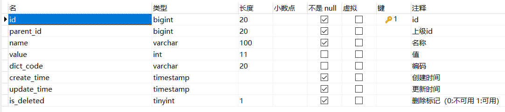

# 01-数据字典介绍


## 一、 简介

何为数据字典？数据字典负责管理系统常用的分类数据或者一些固定数据，例如：省市区三级联动数据、民族数据、行业数据、学历数据等，数据字典帮助我们方便的获取和适用这些通用数据。


## 二、数据字典的设计



- **parent_id**：上级id，通过id与parent_id构建上下级关系，例如：我们要获取所有行业数据，那么只需要查询parent_id=20000的数据
- **name**：名称，例如：填写用户信息，我们要select标签选择民族，“汉族”就是数据字典的名称
- **value**：值，例如：填写用户信息，我们要select标签选择民族，“1”（汉族的标识）就是数据字典的值
- **dict_code**：编码，编码是我们自定义的，全局唯一，例如：我们要获取行业数据，我们可以通过parent_id获取，但是parent_id是不确定的，所以我们可以根据编码来获取行业数据


# 02-Excel 数据批量导入


## 一、前端页面

### 1. 路由

在 **src/router/index.js** 中添加 数据字典的路由

```js
  {
    path: "/core/dict",
    component: Layout,
    redirect: '/core/dict/list',
    meta: { title: '系统设置', icon: 'el-icon-setting' },
    children: [
      {
        path: "list",
        name: "数据字典",
        component: () => import("@/views/core/dict/list"),
        meta: {title: "数据字典" }
      }
    ]
  },
```


### 2. 页面

创建 **src/views/core/dict/list.vue**

```html
<template>
  <div class="app-container">
    <div style="margin-bottom: 10px;">
      <el-button
        @click="dialogVisible = true"
        type="primary"
        size="mini"
        icon="el-icon-download"
      >
        导入Excel
      </el-button>
    </div>

    <el-dialog title="数据字典导入" :visible.sync="dialogVisible" width="30%">
      <el-form>
        <el-form-item label="请选择Excel文件">
          <el-upload
            :before-upload="beforeFileUpload"
            :auto-upload="true"
            :multiple="false"
            :limit="1"
            :on-exceed="fileUploadExceed"
            :on-success="fileUploadSuccess"
            :on-error="fileUploadError"
            :action="BASE_API + '/admin/core/dict/import'"
            name="file"
            accept="application/vnd.ms-excel,application/vnd.openxmlformats-officedocument.spreadsheetml.sheet"
          >
            <el-button size="small" type="primary">点击上传</el-button>
          </el-upload>
        </el-form-item>
      </el-form>                                                                                                                                                                                           
      <div slot="footer" class="dialog-footer">
        <el-button @click="dialogVisible = false">
          取消
        </el-button>
      </div>
    </el-dialog>
  </div>
</template>
```


### 3. Js

```js
export default {
    // 定义数据模型
    data() {
        return {
            dialogVisible: false, // 上传文件对话框是否开启
            BASE_API: process.env.VUE_APP_BASE_API //获取后端接口地址
        }
    },
    methods: {
        // 上传之前，判断文件类型，只能上传 Excel
        beforeFileUpload(file) {
            const fileType = file.type === "application/vnd.openxmlformats-officedocument.spreadsheetml.sheet" ||
                        file.type === "application/vnd.ms-excel";            
            if(!fileType) {
                this.$message.error("请上传 Excel 文件")
            }
            return fileType
        },

        // 文件上传超出
        fileUploadExceed() {
            this.$message.warning("只能上传一个文件")
        },

        // 文件上传成功
        fileUploadSuccess(res) {
            if(res.code == 0){
                this.$message.success("数据导入成功")
                this.dialogVisible = false
            } else {
                this.$meesage.error(res.message)
            }
            
        },

        // 文件上传失败
        fileUploadError(error) {
            this.$message.error("数据导入失败")
        }
    }
}
```

### 4. 运行结果


## 二、后端接口

### 1. 添加依赖

在 **srb-core** 的 pom 中添加依赖

```xml
<dependency> 
    <groupId>com.alibaba</groupId>
    <artifactId>easyexcel</artifactId>
</dependency>

<dependency>
    <groupId>org.apache.xmlbeans</groupId>
    <artifactId>xmlbeans</artifactId>
</dependency>
```


### 2. 创建 Excel 实体类

```java
package com.frankeleyn.srb.core.pojo.dto;

@Data
public class ExcelDictDTO {

    @ExcelProperty("id")
    private Long id;

    @ExcelProperty("上级id")
    private Long parentId;

    @ExcelProperty("名称")
    private String name;

    @ExcelProperty("值")
    private Integer value;

    @ExcelProperty("编码")
    private String dictCode;
}
```


### 3. Mapper 接口

**DictMapper** 接口添加一个方法：

```java
// 批量插入
void insertBatch(List<ExcelDictDTO> list);
```

**DictMapper.xml**

```xml
<insert id="insertBatch">
    INSERT INTO dict(id,  parent_id,  name,  value,  dict_code)
    VALUES
    <foreach collection="list" item="item" separator=",">
        (#{item.id}, #{item.parentId}, #{item.name}, #{item.value}, #{item.dictCode})
    </foreach>
</insert>
```


### 4. 创建监听器

```java
package com.frankeleyn.srb.core.listener;

public class ExcelDictDTOListener extends AnalysisEventListener<ExcelDictDTO> {

    private DictMapper dictMapper;

    private static final long BATCH_COUNT = 10;

    List<ExcelDictDTO> dtoList = new ArrayList<>();

    // 通过构造器传入 dictMapper
    public ExcelDictDTOListener(DictMapper dictMapper) {
        this.dictMapper = dictMapper;
    }

    @Override
    public void invoke(ExcelDictDTO data, AnalysisContext context) {
        System.out.println("读取到一条数据 " + data.getName());
        dtoList.add(data);
        // 达到设定的阈值，就去存储数据库，清空 dtoList，防止 OOM
        if (dtoList.size() > BATCH_COUNT) {
            saveData();
            dtoList.clear();
        }
    }

    @Override
    public void doAfterAllAnalysed(AnalysisContext context) {
        saveData();
        System.out.println("已读完");
    }

    // 保存数据进数据库
    private void saveData() {
        dictMapper.insertBatch(dtoList);
    }
}

```


### 5. 创建 Service

**DictService**

```java
boolean importData(MultipartFile file);
```

**DictServiceImpl**

```java
@Override
public boolean importData(MultipartFile file) {

    try {
        EasyExcel.read(file.getInputStream(), ExcelDictDTO.class, new ExcelDictDTOListener(baseMapper)).sheet("数据字典").doRead();
    } catch (IOException e) {
        e.printStackTrace();
        return false;
    }

    return true;
}
```


### 6. Controller

**AdminDictController** 接收客户端的上传：

```java
package com.frankeleyn.srb.core.controller.admin;

@Api(tags = "数据字典管理 Api")
@RestController
@RequestMapping("/admin/core/dict")
@CrossOrigin
public class AdminDictController {

    @Autowired
    DictService dictService;

    @ApiOperation("Excel批量导入数据字典")
    @PostMapping("import")
    public R importFIle( @ApiParam(value = "Excel文件", required = true) @RequestParam("file") MultipartFile file) {
        Assert.isTrue(dictService.importData(file), ResponseEnum.UPLOAD_ERROR);
        return R.ok();
    }
    
}
```


### 7. 解决找不到 Mapper 自定义方法的错误

上述这么写，运行的时候，会报一个错，找不到 **DictMapper** 自定义的方法：

```bash
org.apache.ibatis.binding.BindingException: Invalid bound statement (not found): com.frankeleyn.srb.core.mapper.DictMapper.insertBatch
```

这是**因为我们自动生成 xml 的时候，生成在 src/main/java，而不是 src/main/resouce**，需要改两个地方：

**pom.xml**

```xml
<build>

    <resources>
        <resource>
            <directory>src/main/java</directory>
            <includes>
                <include>**/*.xml</include>
            </includes>
            <filtering>false</filtering>
        </resource>
    </resources>
</build>
```

**application.propertites**

```properties
# ================ mybatis 配置 =========================
# 驼峰命名
mybatis-plus.configuration.map-underscore-to-camel-case=true
mybatis-plus.mapper-locations=classpath:com/frankeleyn/srb/core/mapper/xml/*.xml
```


最好的解决方法是，直接将 xml 移动到你的 **src/main/resouce** 目录下


