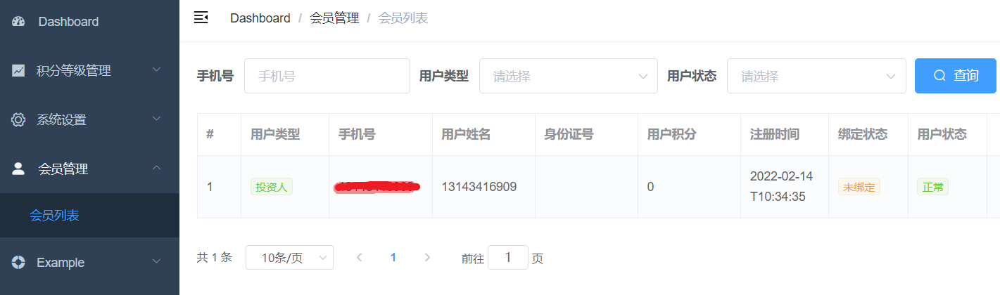
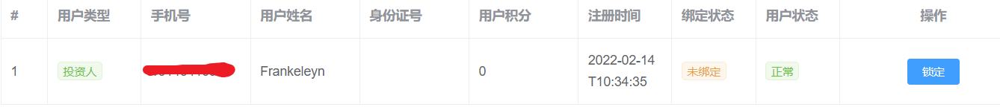
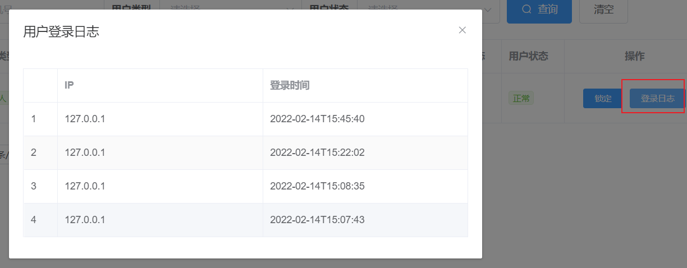

# 用户管理


# 01-列表展示


## 一、前端整合

### 1. 路由

修改 **src/router/index.js**，添加路由

```js
  {
    path: "/core/user-info",
    component: Layout,
    redirect: '/core/user-info/list',
    meta: { title: '会员管理', icon: 'user' },
    alwaysShow: true,
    children: [
      {
        path: "list",
        name: "会员列表",
        component: () => import("@/views/core/user-info/list"),
        meta: {title: "会员列表" }
      }
    ]
  },
```


### 2. Api

创建文件 **src/api/core/user-info.js**

```js
import request from '@/utils/request'

export default {
    getPageList(page, limit, searchObj) {
        return request({
            url: `/admin/core/userInfo/list/${page}/${limit}`,
            method: 'get',
            params: searchObj
        })
    }
}
```


### 3. 页面组件模板

新建 **views/core/user-info/list.vue**

```html
<template>
  <div class="app-container">
    <!--查询表单-->
    <el-form :inline="true" class="demo-form-inline">
      <el-form-item label="手机号">
        <el-input v-model="searchObj.mobile" placeholder="手机号" />
      </el-form-item>

      <el-form-item label="用户类型">
        <el-select v-model="searchObj.userType" placeholder="请选择" clearable>
          <el-option label="投资人" value="1" />
          <el-option label="借款人" value="2" />
        </el-select>
      </el-form-item>

      <el-form-item label="用户状态">
        <el-select v-model="searchObj.status" placeholder="请选择" clearable>
          <el-option label="正常" value="1" />
          <el-option label="锁定" value="0" />
        </el-select>
      </el-form-item>

      <el-button type="primary" icon="el-icon-search" @click="fetchData()">
        查询
      </el-button>
      <el-button type="default" @click="resetData()">清空</el-button>
    </el-form>

    <!-- 列表 -->
    <el-table :data="list" border stripe>
      <el-table-column label="#" width="50">
        <template slot-scope="scope">
          {{ (page - 1) * limit + scope.$index + 1 }}
        </template>
      </el-table-column>

      <el-table-column label="用户类型" width="100">
        <template slot-scope="scope">
          <el-tag v-if="scope.row.userType === 1" type="success" size="mini">
            投资人
          </el-tag>
          <el-tag
            v-else-if="scope.row.userType === 2"
            type="warning"
            size="mini"
          >
            借款人
          </el-tag>
        </template>
      </el-table-column>
      <el-table-column prop="mobile" label="手机号" />
      <el-table-column prop="name" label="用户姓名" />
      <el-table-column prop="idCard" label="身份证号" />
      <el-table-column prop="integral" label="用户积分" />
      <el-table-column prop="createTime" label="注册时间" width="100" />
      <el-table-column label="绑定状态" width="90">
        <template slot-scope="scope">
          <el-tag v-if="scope.row.bindStatus === 0" type="warning" size="mini">
            未绑定
          </el-tag>
          <el-tag
            v-else-if="scope.row.bindStatus === 1"
            type="success"
            size="mini"
          >
            已绑定
          </el-tag>
          <el-tag v-else type="danger" size="mini">绑定失败</el-tag>
        </template>
      </el-table-column>
      <el-table-column label="用户状态" width="90">
        <template slot-scope="scope">
          <el-tag v-if="scope.row.status === 0" type="danger" size="mini">
            锁定
          </el-tag>
          <el-tag v-else type="success" size="mini">
            正常
          </el-tag>
        </template>
      </el-table-column>
    </el-table>

    <!-- 分页组件 -->
    <el-pagination
      :current-page="page"
      :total="total"
      :page-size="limit"
      :page-sizes="[10, 20]"
      style="padding: 30px 0; "
      layout="total, sizes, prev, pager, next, jumper"
      @size-change="changePageSize"
      @current-change="changeCurrentPage"
    />
  </div>
</template>

```


### 4. 页面组件脚本

```js
import userInfoApi from '@/api/core/user-info'

export default {
    data() {
        return {
            list: null, // 数据列表
            total: 0, // 总记录数
            page: 1, // 当前页
            limit: 10, // 每页条数
            searchObj: {}, // 查询条件
            loginRecordList: [], // 会员登录日志
            dialogTableVisible: false // 对话框是否显示
        }
    },

    created() {
        this.fetchData()
    },

    methods: {

        // 获取后台数据
        fetchData() {
            userInfoApi.getPageList(this.page, this.limit, this.searchObj)
                .then(res => {
                  this.list = res.data.pageModel.records
                  this.total = res.data.pageModel.total
                })
        },

        // 清空列表
        resetData() {
            this.searchObj = {}
            this.fetchData()
        },

        // 更改每页显示条数
        changePageSize(pageSize) {
          this.limit = pageSize
          this.fetchData()
        },

        // 改变页码
        changeCurrentPage(page) {
          this.page = page
          this.fetchData()
        },
    }
}
```


### 5. 实现效果




## 二、后端接口

### 1. 创建查询对象

```java
package com.frankeleyn.srb.core.pojo.query;

@Data
@ApiModel(description="会员搜索对象")
public class UserInfoQuery {

    @ApiModelProperty(value = "手机号")
    private String mobile;

    @ApiModelProperty(value = "状态")
    private Integer status;

    @ApiModelProperty(value = "1：出借人 2：借款人")
    private Integer userType;
}
```


### Service

#### UserInfoService 接口

```java
    /**
     * 分页查询
     * @param currentPage
     * @param limit
     * @param userInfoQuery
     * @return
     */
    Page<UserInfo> lsitPage(Long currentPage, Long limit, UserInfoQuery userInfoQuery);
```

#### UserInfoService 实现类

```java
@Override
public Page<UserInfo> lsitPage(Long currentPage, Long limit, UserInfoQuery userInfoQuery) {

    // 查询条件
    QueryWrapper<UserInfo> queryWrapper = new QueryWrapper<>();
    queryWrapper.eq(StringUtils.isNotBlank(userInfoQuery.getMobile()),"mobile", userInfoQuery.getMobile())
        .eq(null != userInfoQuery.getUserType(),"user_type", userInfoQuery.getUserType())
        .eq(null != userInfoQuery.getStatus(), "status", userInfoQuery.getStatus());

    // 分页查询
    Page<UserInfo> userInfoPage = new Page<>();
    userInfoPage.setSize(limit);
    userInfoPage.setPages(currentPage);
    Page<UserInfo> page = baseMapper.selectPage(userInfoPage, queryWrapper);

    return page;
}
```


### Controller

新建 **AdminUserInfoController**

```java
package com.frankeleyn.srb.core.controller.admin;

@CrossOrigin
@RestController
@RequestMapping("/admin/core/userInfo")
public class AdminUserInfoController {

    @Autowired
    private UserInfoService userInfoService;

    @GetMapping("/list/{page}/{limit}")
    public R list(@PathVariable("page") Long currentPage, @PathVariable("limit") Long limit, UserInfoQuery userInfoQuery) {
        IPage<UserInfo> page = userInfoService.lsitPage(currentPage, limit, userInfoQuery);
        return R.ok("pageModel", page);
    }
}
```


# 02-锁定和解锁


## 一、前端整合

### 1. Api

修改 **src/api/core/user-info.js**

```js
lock(id, status) {
    return request({
        url: `/admin/core/userInfo/lock/${id}/${status}`,
        method: 'put'
    })
}
```


### 2. 组件模板

```html
<el-table-column label="操作" align="center" width="200">
    <template slot-scope="scope">
        <el-button
                   v-if="scope.row.status == 1"
                   type="primary"
                   size="mini"
                   @click="lock(scope.row.id, 0)"
                   >
            锁定
        </el-button>
        <el-button
                   v-else
                   type="danger"
                   size="mini"
                   @click="lock(scope.row.id, 1)"
                   >
            解锁
        </el-button>
    </template>
</el-table-column>
```


### 3. 组件脚本

```js
lock(id, status) {
    userInfoApi.lock(id, status)
        .then(res => {
        this.$message.success("操作成功")
        this.fetchData()
    })
},
```


### 4. 实现效果




## 二、后端接口

### 1. Service

#### UserInfoService 接口

```java
    /**
     * 会员锁定
     * @param id
     * @param status
     */
    void lock(Long id, Integer status);
```

#### UserInfoService 实现类

```java
@Override
public void lock(Long id, Integer status) {
    UserInfo userInfo = new UserInfo();
    userInfo.setId(id);
    userInfo.setStatus(status);

    baseMapper.updateById(userInfo);
}
```


### 2. Controller

修改 **AdminUserInfoController** 添加 **lock()** 方法

```java
@PutMapping("lock/{id}/{status}")
public R lock(@PathVariable("id") Long id, @PathVariable("status") Integer status) {
    userInfoService.lock(id, status);
    return R.ok();
}
```


# 03-用户日志


## 一、前端整合

### 1. Api

修改 **src/api/core/user-info.js**

````js
getUserLoginRecordTop50(id) {
    return request({
        url: `/admin/core/userLoginRecord/getUserLoginRecordTop50/${id}`,
        method: 'get'
    })
},
````


### 2. 页面组件模板

```html
<el-button
           type="primary"
           size="mini"
           @click="showLoginRecord(scope.row.id)"
           >
    登录日志
</el-button>
```


### 3. 页面组件脚本

```js
showLoginRecord(id) {
    //打开对话框
    this.dialogTableVisible = true
    //加载数据列表
    userInfoApi.getUserLoginRecordTop50(id).then(res => {
        this.loginRecordList = res.data.list
    })
},
```


### 4. 实现效果




## 二、后端接口


### 1. Service

#### UserLoginRecordService 接口

```java
List<UserLoginRecord> getUserLoginRecordTop50(Integer userId);
```

#### UserLoginRecordService  实现

````java
@Override
public List<UserLoginRecord> getUserLoginRecordTop50(Integer id) {

    QueryWrapper<UserLoginRecord> queryWrapper = new QueryWrapper<>();
    queryWrapper.eq("user_id", id).last("limit 50");
    queryWrapper.orderByDesc("create_time");

    List<UserLoginRecord> recordList = baseMapper.selectList(queryWrapper);

    return recordList;
}
````


### 2. Controller

新建 **AdminUserLoginRecordController**

```java
package com.frankeleyn.srb.core.controller.admin;

@CrossOrigin
@RestController
@RequestMapping("/admin/core/userLoginRecord")
public class AdminUserLoginRecordController {

    @Autowired
    private UserLoginRecordService userLoginRecordService;

    @GetMapping("/getUserLoginRecordTop50/{id}")
    public R getUserLoginRecordTop50(@PathVariable("id") Integer userId) {
        List<UserLoginRecord> recordList = userLoginRecordService.getUserLoginRecordTop50(userId);
        return R.ok("list", recordList);
    }
}
```


