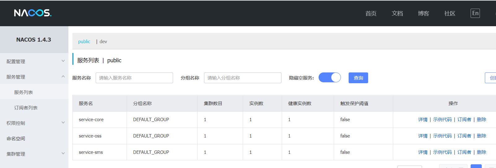

# 整合 Spring Cloud


# 01-注册中心与服务发现


## 一、下载运行 Nacos


## 二、整合 Nacos

### 1. 引入依赖

在 **service-base** 中，引入依赖

```xml
<dependency>
    <groupId>com.alibaba.cloud</groupId>
    <artifactId>spring-cloud-starter-alibaba-nacos-discovery</artifactId>
</dependency>
```


### 2. 修改配置文件

修改 **service-core**, **service-sms**, **service-oss** 的配置文件，添加 nacos 的配置

```properties
# 加个应用名
spring.application.name=项目名

# =============== Nacos 配置 ===============
spring.cloud.nacos.discovery.server-addr=localhost:8848
```


### 3. 启动类添加注解

在上述三个微服务的启动类上 添加注解 **@EnableDiscoveryClient**


### 4. 启动微服务




# 02-整合 OpenFeign

## 一、校验手机号是否被注册

### 1. UserInfoService

**UserInfoService** 接口

```java
    /**
     * 检查手机号是否被注册
     * @param mobile
     * @return
     */
    boolean checkMobile(String mobile);
```

**UserInfoService** 实现

```java
@Override
public boolean checkMobile(String mobile) {
    QueryWrapper<UserInfo> queryWrapper = new QueryWrapper<>();
    queryWrapper.eq("mobile", mobile);
    Integer count = baseMapper.selectCount(queryWrapper);
    if (Objects.nonNull(count) || count > 0) {
        return false;
    }

    return true;
}
```


### 2. UserInfoController

**ApiUserInfoController** 添加方法：

```java
@GetMapping("/checkMobile/{mobile}")
public boolean checkMobile(@PathVariable("mobile") String mobile) {
    return userInfoService.checkMobile(mobile);
}
```


## 二、引入依赖

在 **service-base** 中添加依赖

```xml
<dependency>
    <groupId>org.springframework.cloud</groupId>
    <artifactId>spring-cloud-starter-openfeign</artifactId>
</dependency>
```


## 三、配置文件

**openfeign** 默认的连接超时时间为1秒，测试时很可能会出现远程调用超时错误，项目上线后就不要设置超时时间了。

修改 **service-sms** 的配置文件添加配置

```properties
# =============== Feign 配置 ===============
# 连接超时配置
feign.client.config.default.connect-timeout=10000
# 执行超时配置
feign.client.config.default.read-timeout=600000
```


## 四、添加启动类注解

在 **service-sms** 的启动类添加注解

**@EnableFeignClients**


## 五、接口远程调用

**service-sms** 中添加远程调用

### 1. 新建 CoreUserInfoClient 接口

```java
package com.frankeleyn.srb.sms.client;

@FeignClient("service-core")
@RequestMapping("/api/core/userInfo")
public interface CoreUserInfoClient {

    @GetMapping("/checkMobile/{mobile}")
    boolean checkMobile(@PathVariable("mobile") String mobile);
}
```


### 2. 修改 ApiSmsController

```java
@GetMapping("/send/{mobile}")
public R send(@ApiParam("手机号码") @PathVariable("mobile") String mobile) {
    // 校验手机号
    boolean checkCellphone = RegexValidateUtils.checkCellphone(mobile);
    Assert.isTrue(checkCellphone, ResponseEnum.MOBILE_ERROR);

    // 手机号是否已被注册
    boolean checkMobile = coreUserInfoClient.checkMobile(mobile);
    Assert.isTrue(checkMobile, ResponseEnum.MOBILE_EXIST_ERROR);

    // 调用业务层的发送短信流程
    smsService.send(mobile);
    return R.ok();
}
```


## 六、找个被注册的手机号测试


# 03-整合 Sentinel


## 一、引入依赖

在 **service-base** 中添加依赖

```xml
<!--服务容错-->
<dependency>
    <groupId>com.alibaba.cloud</groupId> 
    <artifactId>spring-cloud-starter-alibaba-sentinel</artifactId>
</dependency>
```


## 二、配置文件

在 **service-sms** 中配置 **Sentinel** 

```properties
# =============== Sentinel 配置 ===============
spring.cloud.sentinel.transport.dashboard=localhost:8080
spring.cloud.sentinel.transport.port=8719
# 开启Feign对Sentinel的支持
feign.sentinel.enabled=true
```


## 三、配置容错类

在 **service-sms** 创建 **CoreUserInfoClientFallback**

```java
package com.frankeleyn.srb.sms.client.fallback;

@Service
public class CoreUserInfoClientFallback implements CoreUserInfoClient {
    @Override
    public boolean checkMobile(String mobile) {
        System.out.println("core 服务 checkMobile 接口调用失败");
        return false;
    }
}
```


## 四、指定熔断类

修改 **service-sms** 中的 **CoreUserInfoClient ** 接口

```java
package com.frankeleyn.srb.sms.client;

@FeignClient(value = "service-core", fallback = CoreUserInfoClientFallback.class)
@RequestMapping("/api/core/userInfo")
public interface CoreUserInfoClient {

    @GetMapping("/checkMobile/{mobile}")
    boolean checkMobile(@PathVariable("mobile") String mobile);
}
```


# 04-微服务网关


## 一、创建 service-gateway 模块

### 1. 创建模块

在 srb 下创建普通 maven 模块

**Artifact**：service-gateway


## 2. 引入依赖

```xml
<!-- 网关 -->
<dependency>
    <groupId>org.springframework.cloud</groupId>
    <artifactId>spring-cloud-starter-gateway</artifactId>
</dependency>

<!--服务注册-->
<dependency>
    <groupId>com.alibaba.cloud</groupId>
    <artifactId>spring-cloud-starter-alibaba-nacos-discovery</artifactId>
</dependency>
```


### 3. 配置文件

```properties
server.port=80
spring.application.name=service-gateway
spring.cloud.nacos.discovery.server-addr=localhost:8848
# gateway 可以发现 nacos 中的微服务，并自动生成转发路由
spring.cloud.gateway.discovery.locator.enabled=true
```


### 4. 启动类

```java
package com.frankeleyn.srb.gateway;

@SpringBootApplication
@EnableDiscoveryClient
public class ServiceGatewayApplication {

    public static void main(String[] args) {
        SpringApplication.run(ServiceGatewayApplication.class, args);
    }
}
```


## 二、路由配置

### 1. 添加配置

**service-gateway** 配置文件中添加配置：

```properties
# 路由配置
spring.cloud.gateway.routes[0].id=service-core
spring.cloud.gateway.routes[0].uri=lb://service-core
spring.cloud.gateway.routes[0].predicates[0]=Path=/*/core/**

spring.cloud.gateway.routes[1].id=service-sms
spring.cloud.gateway.routes[1].uri=lb://service-sms
spring.cloud.gateway.routes[1].predicates[0]=Path=/*/sms/**

spring.cloud.gateway.routes[2].id=service-oss
spring.cloud.gateway.routes[2].uri=lb://service-oss
spring.cloud.gateway.routes[2].predicates[0]=/*/oss/**
```


### 2. 测试路由转发

测试前，记得关掉 nginx

访问 http://localhost/admin/core/integralGrade/list


## 三、跨域配置

### 1. 配置文件

在 **service-gateway** 中添加配置文件

```java
package com.frankeleyn.srb.gateway.config;

@Configuration
public class CorsConfig {

    @Bean
    public CorsWebFilter corsWebFilter() {
        CorsConfiguration config = new CorsConfiguration();
        config.setAllowCredentials(true); // 允许携带 cookie
        config.addAllowedOrigin("*"); // 可接受的域，* 代表任何域都可以
        config.addAllowedHeader("*"); // 允许携带任何请求头
        config.addAllowedMethod("*"); // 允许任何访问方式

        UrlBasedCorsConfigurationSource source = new UrlBasedCorsConfigurationSource();
        source.registerCorsConfiguration("/**", config);

        return new CorsWebFilter(source);
    }
}
```


### 2. 删除微服务中的跨域

配置完网关跨域，就**必须删除**微服务中的跨域注解 **@CrossOrigin**，因为浏览器不允许有多个 CORS 头。
