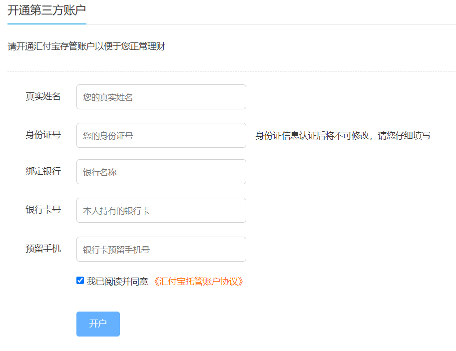

# 账户绑定业务


## 业务流程

① 用户点击开户

② 调用 srb 用户绑定接口

③ 后台调用汇付宝接口

④ 返回一个携带参数的表单

⑤ 浏览器跳转汇付宝

⑥ 用户在汇付宝确认信息

⑦ 汇付宝保存用户信息

⑧ 汇付宝回调 srb 接口

⑨ srb 保存汇付宝返回的 bindCode

 


# 01-调用汇付宝实现账户创建


## 一、准备工作


### 1. 启动汇付宝

启动 hfb，用于模拟第三方资金托管平台的一个程序。


### 2. 引入工具类


## 二、前端整合


### 1. 页面

修改**srb-site** 中的 **pages/user/index.vue**

```html
<template>
  <div class="personal-main">
    <div class="pmain-profile">
      <div class="pmain-welcome">
        <span class="fr">上次登录时间： 2020-09-11 14:05:07 </span>
      </div>
      <div class="pmain-user">
        <div class="user-head">
          <span class="head-img" title="点击更换头像">
            <span>
              
              <i class="headframe" style="z-index:0;"></i>
            </span>
          </span>
        </div>
        <div class="user-info">
          <ul>
            <li>
              用户名<span>tg_gpdt0139</span>
              <NuxtLink v-if="$parent.userType === 2" to="/user/borrower">
                立即借款
              </NuxtLink>
            </li>
            <li>
              您还未开通第三方支付账户，请
              <NuxtLink to="/user/bind">立即开通</NuxtLink>
              以确保您的正常使用和资金安全。
            </li>
          </ul>
        </div>
      </div>
      <div class="pmain-money">
        <ul v-if="$parent.userType === 1">
          <li class="none">
            <span>
              <em>账户余额</em>
              <i class="markicon"></i>
            </span>
            <span class="truemoney"><i class="f26 fb">0.00 </i> 元</span>
          </li>
          <li>
            <span>
              <em>冻结金额</em>
              <i class="markicon"></i>
            </span>
            <span class="truemoney"><i class="f26 fb">0.00 </i>元</span>
          </li>
          <li>
            <span>
              <em>累计收益</em>
              <i class="markicon"></i>
            </span>
            <span class="truemoney"><i class="f26 fb c-pink">0.00 </i> 元</span>
          </li>
        </ul>
        <ul v-if="$parent.userType === 2">
          <li class="none">
            <span>
              <em>账户余额</em>
              <i class="markicon"></i>
            </span>
            <span class="truemoney"><i class="f26 fb">0.00 </i> 元</span>
          </li>
          <li>
            <span>
              <em>当前借款金额</em>
              <i class="markicon"></i>
            </span>
            <span class="truemoney"><i class="f26 fb">0.00 </i> 元</span>
          </li>
          <li>
            <span>
              <em>累计借款金额</em>
              <i class="markicon"></i>
            </span>
            <span class="truemoney"><i class="f26 fb c-pink">0.00 </i> 元</span>
          </li>
        </ul>
      </div>
    </div>
  </div>
</template>

<script>
export default {}
</script>
```


**srb-site** 添加 **pages/user/bind.vue** 页面

```html
<template>
  <div class="personal-main">
    <div class="personal-pay">
      <h3><i>开通第三方账户</i></h3>
      <div class="pay-notice">
        <p>请开通汇付宝存管账户以便于您正常理财</p>
      </div>
      <div class="pay-form">
        <ul>
          <li>
            <label>真实姓名</label>
            <input
              v-model="userBind.name"
              type="text"
              class="pay-txt"
              maxlength="16"
              placeholder="您的真实姓名"
            />
          </li>
          <li>
            <label>身份证号</label>
            <input
              v-model="userBind.idCard"
              type="text"
              class="pay-txt"
              maxlength="18"
              placeholder="您的身份证号"
            />
            <div id="idCardErrorDiv">
              <p style="margin-top: 10px">
                身份证信息认证后将不可修改，请您仔细填写
              </p>
            </div>
          </li>
          <li>
            <label>绑定银行</label>
            <input
              v-model="userBind.bankType"
              type="text"
              class="pay-txt"
              placeholder="银行名称"
            />
          </li>
          <li>
            <label>银行卡号</label>
            <input
              v-model="userBind.bankNo"
              type="text"
              class="pay-txt"
              placeholder="本人持有的银行卡"
            />
          </li>
          <li>
            <label>预留手机</label>
            <input
              v-model="userBind.mobile"
              type="text"
              class="pay-txt"
              placeholder="银行卡预留手机号"
            />
          </li>
          <li>
            <label>&nbsp;</label>
            <input v-model="agree" type="checkbox" />
            我已阅读并同意
            <a href="#" class="c-orange" target="_blank">
              《汇付宝托管账户协议》
            </a>
          </li>
          <li>
            <label>&nbsp;</label>
            <el-button :disabled="!agree" @click="commitBind()" type="primary">
              开户
            </el-button>
          </li>
        </ul>
      </div>
    </div>
  </div>
</template>

<script>
export default {
  data() {
    return {
      agree: false,
      userBind: {},
    }
  },

}
</script>
```


### 2. 页面脚本

修改 **pages/user/bind.vue**

```js
export default {
  data() {
    return {
      agree: false,
      userBind: {},
    }
  },
  
  methods: {

      commitBind() {
          this.$alert('即将前往第三方平台开通账户','前往汇付宝',{
                dangerouslyUseHTMLString: true,
                confirmButtonText: '立即前往',
                callback:(action) => {
                    if(action == 'confirm') {
                        this.$axios.$post('/api/core/userBind/auth/bind', this.userBind)
                            .then(res => {
                                document.write(res.data.formStr)
                            })
                    }
                }
          })
      }
  }

}
```


### 3. 实现效果




## 三、后端接口

### 1. Controller

新建 **ApiUserBindController**

```java
package com.frankeleyn.srb.core.controller.api;

@RestController
@RequestMapping("/api/core/userBind")
public class ApiUserBindController {

        @Autowired
        private UserBindService userBindService;

        @PostMapping("/auth/bind")
        public R userBind(@RequestBody UserBindVO userBindVO, HttpServletRequest request) {
            String token = request.getHeader("token");
            Assert.notNull(token, ResponseEnum.LOGIN_AUTH_ERROR);
            Long userId = JwtUtils.getUserId(token);

            // 调用汇付宝 api 接口，生成汇付宝表单
            String formStr = userBindService.bind(userBindVO, userId);
            return R.ok("formStr", formStr);
        }
}
```


### 2. Service

**UserBindService** 接口添加一个新方法

```java
    /**
     * 账户绑定提交数据到托管平台
     * @param userBindVO
     * @param userId
     * @return
     */
    String bind(UserBindVO userBindVO, Long userId);
```

**UserBindService** 实现类

```java
@Override
public String bind(UserBindVO userBindVO, Long userId) {

    // 1. 将用户账户信息保存到 srb
    UserBind userBind = baseMapper.selectOne(new QueryWrapper<UserBind>().eq("user_id", userId));
    if (Objects.nonNull(userBind)) {
        // 用户之前绑定过
        BeanUtils.copyProperties(userBindVO, userBind);
        baseMapper.updateById(userBind);
    } else {
        // 用户之前没绑定过
        userBind = new UserBind();
        userBind.setUserId(userId);
        BeanUtils.copyProperties(userBindVO, userBind);
        baseMapper.insert(userBind);
    }

    // 2. 根据提交的参数和 api 生成汇付宝表单
    Map<String, Object> paramMap = new HashMap<>();
    paramMap.put("agentId", HfbConst.AGENT_ID);
    paramMap.put("agentUserId", userId);
    paramMap.put("idCard",userBindVO.getIdCard());
    paramMap.put("personalName", userBindVO.getName());
    paramMap.put("bankType", userBindVO.getBankType());
    paramMap.put("bankNo", userBindVO.getBankNo());
    paramMap.put("mobile", userBindVO.getMobile());
    paramMap.put("returnUrl", HfbConst.USERBIND_RETURN_URL);
    paramMap.put("notifyUrl", HfbConst.USERBIND_NOTIFY_URL);
    paramMap.put("timestamp", RequestHelper.getTimestamp());
    paramMap.put("sign", RequestHelper.getSign(paramMap));

    String formStr = FormHelper.buildForm(HfbConst.USERBIND_URL, paramMap);
    return formStr;
}
```


# 02-回调接口实现账户绑定


## 后端接口


### 1. Service

**UserBindService** 接口添加一个新方法

```java
    /**
     * 回调接口
     * @param paramMap
     */
    void notified(Map<String, Object> paramMap);
```

**UserBindService** 实现类

```java
@Resource
private UserInfoMapper userInfoMapper;

@Override
public void notified(Map<String, Object> paramMap) {
    // 获取参数
    String bind_code = (String) paramMap.get("bindCode");
    String userId = (String) paramMap.get("agentUserId");

    // 1. 更新用户的绑定信息 Table: user_bind  Field: bind_code|status
    UserBind userBind = baseMapper.selectOne(new QueryWrapper<UserBind>().eq("user_id", userId));
    userBind.setBindCode(bind_code);
    userBind.setStatus(UserBindEnum.BIND_OK.getStatus());
    baseMapper.updateById(userBind);

    // 2. 更新用户的信息 Table: user_info  Field: name|nick_name|id_card|bind_status
    UserInfo userInfo = userInfoMapper.selectById(userId);
    userInfo.setName(userBind.getName());
    userInfo.setNickName(userBind.getName());
    userInfo.setIdCard(userBind.getIdCard());
    userInfo.setBindStatus(UserBindEnum.BIND_OK.getStatus());
    userInfo.setBindCode(bind_code);
    userInfoMapper.updateById(userInfo);
}
```


### 2. Controller

修改 **ApiUserBindController**

```java
@PostMapping("/notify")
public String notified(HttpServletRequest request) {
    Map<String, Object> paramMap = RequestHelper.switchMap(request.getParameterMap());
    // 验签
    boolean signEquals = RequestHelper.isSignEquals(paramMap);
    Assert.isTrue(signEquals, ResponseEnum.WEIXIN_CALLBACK_PARAM_ERROR);

    userBindService.notified(paramMap);
    return "success";
}
```
